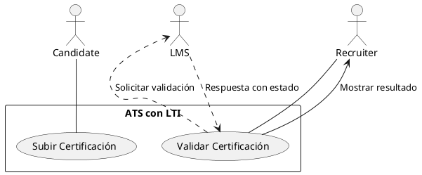
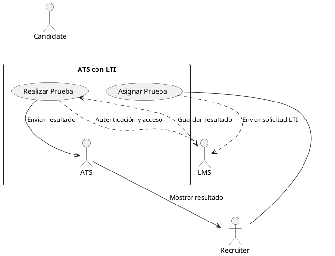
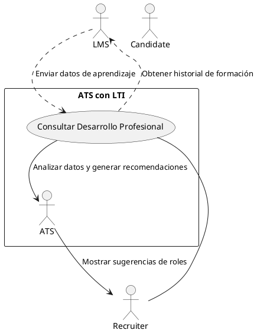
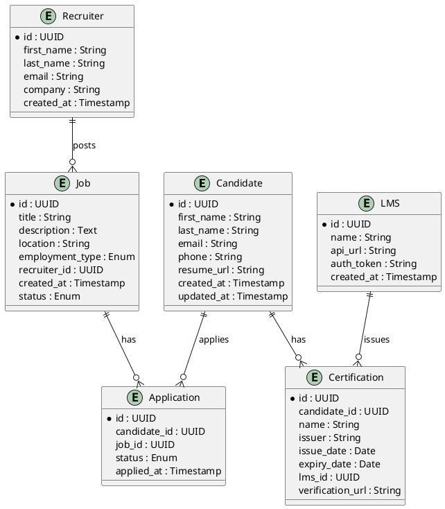
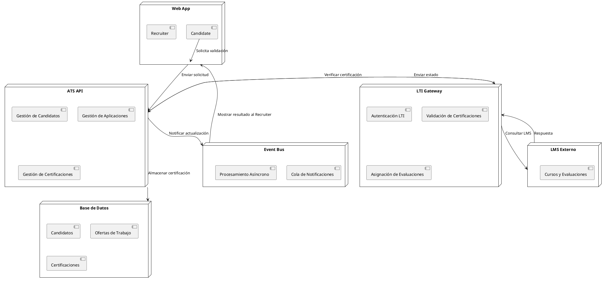

Aquí tienes un análisis detallado sobre la integración de **Learning Tools Interoperability (LTI)** en un **Applicant Tracking System (ATS)**.

---

## 1. Descripción del software LTI y su propuesta de valor

### ¿Qué es LTI y cómo funciona?

**Learning Tools Interoperability (LTI)** es un estándar desarrollado por **IMS Global Learning Consortium** que permite la integración de herramientas de aprendizaje externas con **Learning Management Systems (LMS)** y otras plataformas. LTI simplifica la autenticación, el intercambio de datos y la interoperabilidad entre diferentes soluciones educativas y empresariales.

LTI funciona mediante:

1. **Autenticación segura**: Un usuario (por ejemplo, un candidato en un ATS) accede a un LMS o una herramienta de evaluación sin necesidad de múltiples inicios de sesión (Single Sign-On, SSO).
2. **Intercambio de datos en tiempo real**: Se pueden enviar y recibir resultados, certificaciones, calificaciones y progreso de aprendizaje de manera estructurada.
3. **Estándares abiertos**: Facilita la integración sin necesidad de desarrollar APIs propietarias, reduciendo costos y tiempo de implementación.

---

### ¿Por qué es relevante en el contexto de un ATS?

Los ATS tradicionales gestionan el ciclo de vida del candidato, pero tienen **limitaciones en la evaluación de habilidades y el seguimiento del desarrollo profesional**. La integración con **LTI permite conectar un ATS con plataformas de aprendizaje y evaluación**, proporcionando información más rica para la toma de decisiones de contratación y movilidad interna.

**Relevancia clave**:
- Permite la **validación de certificaciones** y credenciales en tiempo real.
- Habilita la integración de **pruebas de habilidades** directamente desde el ATS.
- Facilita el **seguimiento del desarrollo profesional** de candidatos y empleados.

---

### Ventajas competitivas frente a otras soluciones de integración

| **Aspecto**               | **LTI**                                          | **APIs propietarias**                    | **Integraciones personalizadas**         |
|---------------------------|-------------------------------------------------|-----------------------------------------|-----------------------------------------|
| **Estandarización**       | Basado en un estándar global                     | Variable, depende del proveedor        | Depende de la implementación           |
| **Tiempo de implementación** | Rápido, integración sencilla                    | Medio-alto, requiere desarrollo       | Alto, requiere desarrollo extenso      |
| **Escalabilidad**         | Alta, compatible con múltiples LMS y herramientas | Depende del ecosistema                | Puede ser limitada por el diseño       |
| **Mantenimiento**         | Bajo, gestión centralizada de estándares        | Alto, requiere actualizaciones propias | Alto, requiere soporte continuo        |

✅ **Conclusión**: LTI es una solución más ágil, estándar y escalable en comparación con APIs propietarias o integraciones personalizadas.

---

## 2. Funciones principales de LTI en un ATS (ordenadas por prioridad)

### 1️⃣ **Validación de certificaciones y credenciales**  
- Permite que los reclutadores verifiquen automáticamente certificados de cursos, habilidades técnicas y soft skills en plataformas LMS.
- Reduce el riesgo de **fraude en credenciales** y **agiliza la selección** de candidatos calificados.

**Impacto**: Mayor confianza en las certificaciones y reducción del tiempo de verificación manual.

---

### 2️⃣ **Integración de pruebas y evaluaciones**  
- Se pueden asignar y gestionar pruebas de habilidades (técnicas, cognitivas, psicométricas) desde el ATS sin necesidad de múltiples plataformas.
- Resultados integrados en el perfil del candidato en tiempo real.

**Impacto**: Evaluaciones centralizadas, reducción de fricción en el proceso de selección.

---

### 3️⃣ **Seguimiento del desarrollo profesional de candidatos internos**  
- Permite analizar el progreso de aprendizaje de empleados internos para facilitar **movilidad interna y promociones**.
- Integra KPIs de desempeño y formación en la toma de decisiones de RRHH.

**Impacto**: Mejora la retención de talento y optimiza planes de carrera.

---

### 4️⃣ **Gestión de aprendizaje continuo para candidatos preseleccionados**  
- Los candidatos pueden recibir sugerencias de cursos relevantes para mejorar su perfil en función de requisitos del puesto.
- Posibilita el upskilling de candidatos antes de contratarlos.

**Impacto**: Menos riesgo de contratación incorrecta, candidatos mejor preparados.

---

### 5️⃣ **Análisis predictivo basado en datos de aprendizaje**  
- Uso de IA para predecir el **éxito del candidato en el puesto** basándose en desempeño en cursos y evaluaciones.
- Permite recomendaciones inteligentes para mejorar la precisión de contratación.

**Impacto**: Decisiones basadas en datos, menor rotación.

---

## 3. Diagrama Lean Canvas para un ATS con integración LTI

| **Sección**         | **Descripción** |
|---------------------|----------------|
| **Problema**       | 1. Validación manual de certificaciones es lenta y susceptible a fraudes.   2. Evaluaciones de habilidades dispersas y sin estandarización.   3. Falta de integración entre formación y contratación. |
| **Segmentos de clientes** | 1. Empresas de tecnología, consultoría, educación y salud.   2. Equipos de RRHH y talento.   3. Plataformas LMS y de evaluación de talento. |
| **Propuesta de valor** | Un ATS con integración LTI que permite validar certificaciones, realizar pruebas en línea y hacer seguimiento del desarrollo profesional en un solo lugar. |
| **Solución**       | 1. Integración con LMS para validación de certificaciones.   2. Conexión con plataformas de pruebas y exámenes.   3. Monitoreo del aprendizaje y desarrollo del candidato en tiempo real. |
| **Canales**        | 1. API con LMS y plataformas de evaluación.   2. Integración con herramientas de RRHH.   3. Marketplace de plugins para ATS. |
| **Fuentes de ingresos** | 1. Suscripción SaaS por empresa y usuario.   2. Tarifa por integración con LMS externos.   3. Modelo freemium con planes avanzados. |
| **Métricas clave** | 1. Tasa de adopción de integración LTI.   2. Reducción del tiempo de validación de credenciales.   3. Impacto en la precisión de contratación. |
| **Estructura de costos** | 1. Desarrollo y mantenimiento de API LTI.   2. Infraestructura en la nube.   3. Soporte técnico e integraciones personalizadas. |
| **Ventaja injusta** | 1. Primera solución ATS con LTI nativa.   2. Red de LMS y herramientas de evaluación certificadas.   3. Modelo de IA basado en datos de aprendizaje. |

---

## **Conclusión y visión estratégica**

La integración de **LTI en un ATS transforma la contratación** al conectar la validación de habilidades con el proceso de selección. Esta solución **mejora la confianza en las credenciales**, facilita pruebas de habilidades **sin fricción** y permite el **seguimiento del desarrollo profesional** de empleados y candidatos internos.

A nivel de negocio, un **ATS con LTI** se diferencia al ofrecer:
- **Validaciones automáticas** que reducen el tiempo y costos de contratación.
- **Evaluaciones integradas** para mejorar la precisión de selección.
- **Monitoreo del desarrollo profesional**, facilitando movilidad interna.

La clave del éxito será **alianzas con LMS líderes** y el desarrollo de un **ecosistema robusto de aprendizaje** dentro del ATS.

---

Aquí tienes tres casos de uso principales para un **ATS con integración LTI**, incluyendo descripción detallada, flujo principal, variantes y diagramas en **PlantUML**.

---

## **Caso de Uso 1: Validación Automática de Certificaciones**  
**Descripción:**  
Este caso de uso permite a un **Recruiter** validar automáticamente las certificaciones y credenciales de un **Candidate** a través de la integración con un **LMS** compatible con **LTI**.

### **Flujo Principal:**  
1. **Candidate** sube su CV o completa su perfil en el ATS.  
2. **ATS** detecta certificaciones y habilidades declaradas.  
3. **ATS** consulta al **LMS** a través de LTI para validar las certificaciones.  
4. **LMS** responde con la información de certificación validada o rechazada.  
5. **ATS** muestra el estado de validación al **Recruiter**.  
6. **Recruiter** utiliza la información validada para avanzar en el proceso de selección.  

### **Variantes:**  
- **V1**: La certificación no está en el LMS → El **Candidate** recibe una notificación para proporcionar evidencia manual.  
- **V2**: El LMS devuelve múltiples certificaciones para la misma habilidad → El **Recruiter** elige la más relevante.  
- **V3**: Error en la conexión con el LMS → El sistema reintenta automáticamente y notifica al usuario.  

### **Diagrama en PlantUML:**

---

## **Caso de Uso 2: Evaluación de Habilidades en el Proceso de Selección**  
**Descripción:**  
El **Recruiter** puede asignar pruebas de evaluación de habilidades a los **Candidates** directamente desde el ATS, utilizando herramientas de evaluación integradas a través de **LTI**.

### **Flujo Principal:**  
1. **Recruiter** selecciona una evaluación para un **Candidate** dentro del ATS.  
2. **ATS** genera un enlace seguro LTI para la prueba en el **LMS**.  
3. **Candidate** accede a la prueba sin necesidad de otro inicio de sesión (SSO).  
4. **LMS** administra la evaluación y envía los resultados al **ATS**.  
5. **ATS** muestra los resultados al **Recruiter** para tomar decisiones.  

### **Variantes:**  
- **V1**: El **Candidate** no completa la prueba → Se genera un recordatorio automático.  
- **V2**: La prueba está mal configurada en el **LMS** → El **Recruiter** recibe una alerta para corregirlo.  
- **V3**: Se requiere un tiempo límite específico → El ATS configura restricciones en la solicitud LTI.  

### **Diagrama en PlantUML:**

---

## **Caso de Uso 3: Seguimiento del Desarrollo Profesional de Candidatos Internos**  
**Descripción:**  
Las empresas pueden usar el ATS con LTI para monitorear el desarrollo profesional de sus empleados y candidatos internos, facilitando movilidad interna y planes de carrera.

### **Flujo Principal:**  
1. **Recruiter** accede al perfil del empleado o candidato interno en el ATS.  
2. **ATS** obtiene información de cursos y certificaciones desde el **LMS** mediante LTI.  
3. **ATS** analiza los datos y sugiere roles internos adecuados basados en el desarrollo profesional del candidato.  
4. **Recruiter** revisa las recomendaciones y contacta al empleado si hay una oportunidad relevante.  

### **Variantes:**  
- **V1**: El candidato ha completado cursos recomendados → El ATS prioriza su candidatura para roles internos.  
- **V2**: No hay suficientes datos en el **LMS** → Se recomienda un plan de formación adicional.  
- **V3**: Se requiere certificación específica → El ATS sugiere cursos en el **LMS**.  

### **Diagrama en PlantUML:**

---

## **Conclusión**
Estos tres casos de uso ilustran **cómo la integración LTI optimiza un ATS**, permitiendo validaciones automatizadas, evaluaciones eficientes y un mejor seguimiento del desarrollo profesional. Esto **reduce la fricción en el proceso de contratación, mejora la precisión en la selección y fomenta el crecimiento interno del talento**.

Aquí tienes un modelo de datos detallado para un **ATS con integración LTI**, incluyendo entidades, atributos, relaciones y un diagrama en **PlantUML**.

---

## **Entidades y Atributos**

### **1. Candidate**
Representa a un candidato en el sistema.
- `id` (UUID) – Identificador único.
- `first_name` (String) – Nombre del candidato.
- `last_name` (String) – Apellido del candidato.
- `email` (String) – Correo electrónico único.
- `phone` (String) – Número de teléfono.
- `resume_url` (String) – Enlace al CV.
- `created_at` (Timestamp) – Fecha de registro.
- `updated_at` (Timestamp) – Última modificación.

### **2. Recruiter**
Representa a un reclutador que gestiona ofertas y candidatos.
- `id` (UUID) – Identificador único.
- `first_name` (String) – Nombre del reclutador.
- `last_name` (String) – Apellido del reclutador.
- `email` (String) – Correo electrónico único.
- `company` (String) – Empresa asociada.
- `created_at` (Timestamp) – Fecha de registro.

### **3. Job**
Representa una oferta de trabajo publicada en el ATS.
- `id` (UUID) – Identificador único.
- `title` (String) – Título del puesto.
- `description` (Text) – Descripción detallada.
- `location` (String) – Ubicación del puesto.
- `employment_type` (Enum) – Tipo de empleo (Full-time, Part-time, Contract, Internship).
- `recruiter_id` (UUID) – Referencia al reclutador que creó la oferta.
- `created_at` (Timestamp) – Fecha de publicación.
- `status` (Enum) – Estado de la oferta (Open, Closed, On Hold).

### **4. Application**
Registra la postulación de un candidato a una oferta de trabajo.
- `id` (UUID) – Identificador único.
- `candidate_id` (UUID) – Referencia al candidato.
- `job_id` (UUID) – Referencia a la oferta de trabajo.
- `status` (Enum) – Estado de la aplicación (Pending, Reviewed, Interviewing, Rejected, Hired).
- `applied_at` (Timestamp) – Fecha de postulación.

### **5. Certification** *(Integración con LMS a través de LTI)*
Representa certificaciones y credenciales obtenidas a través de un LMS compatible con **LTI**.
- `id` (UUID) – Identificador único.
- `candidate_id` (UUID) – Referencia al candidato.
- `name` (String) – Nombre de la certificación.
- `issuer` (String) – Plataforma o entidad que emitió la certificación.
- `issue_date` (Date) – Fecha de emisión.
- `expiry_date` (Date, Nullable) – Fecha de expiración (si aplica).
- `lms_id` (UUID) – Identificador del LMS de origen.
- `verification_url` (String) – URL para verificación en el LMS.

### **6. LMS**
Registra plataformas LMS integradas con el ATS.
- `id` (UUID) – Identificador único.
- `name` (String) – Nombre de la plataforma.
- `api_url` (String) – URL base de la API de integración.
- `auth_token` (String) – Token de autenticación (encriptado).
- `created_at` (Timestamp) – Fecha de integración.

---

## **Relaciones y Cardinalidad**
1. Un **Recruiter** puede publicar **múltiples Jobs** (1:N).
2. Un **Candidate** puede aplicar a **múltiples Jobs** a través de **Applications** (N:M).
3. Un **Candidate** puede tener **múltiples Certifications** (1:N).
4. Un **Certification** está asociada a un **LMS** que la expidió (N:1).

---

## **Diagrama en PlantUML**

---

## **Conclusión**
Este modelo de datos proporciona una **estructura escalable y optimizada** para un **ATS con integración LTI**, permitiendo:
✅ **Gestión eficiente de candidatos y reclutadores.**  
✅ **Validación automática de certificaciones a través de LMS.**  
✅ **Seguimiento estructurado del proceso de contratación.**  

Aquí tienes una **arquitectura a alto nivel** para un **ATS con integración LTI**, diseñada con principios de **desacoplamiento, modularidad y escalabilidad**.

---
Aquí tienes una arquitectura de alto nivel para un **ATS con integración LTI**, diseñada con principios de **desacoplamiento, modularidad y escalabilidad**.

---

## **Componentes Principales**
1. **Web App (Frontend)**
   - Aplicación web accesible para **candidatos, reclutadores y administradores**.
   - UI optimizada para gestionar **ofertas, aplicaciones y certificaciones**.
   - Comunicación con el backend a través de **RESTful API / GraphQL**.

2. **ATS API (Backend)**
   - **Microservicio central** que gestiona las funcionalidades del ATS.
   - Maneja **candidatos, ofertas de trabajo, aplicaciones y autenticación**.
   - Expone **endpoints REST/GraphQL** para la Web App y otras integraciones.

3. **LTI Gateway (Middleware de Integración)**
   - Actúa como **adaptador LTI**, desacoplando el ATS del LMS.
   - Se comunica con **múltiples LMS** compatibles con **LTI 1.3**.
   - **Funciones clave:** autenticación LTI, validación de certificaciones, integración de evaluaciones.

4. **LMS Externo**
   - Sistemas de aprendizaje que ofrecen **cursos, certificaciones y evaluaciones**.
   - Responde a solicitudes del **LTI Gateway** para validar credenciales o asignar pruebas.

5. **Base de Datos (DB)**
   - **Gestión de datos transaccionales** (candidatos, reclutadores, aplicaciones, certificaciones).
   - **Relacional (PostgreSQL, MySQL)** para datos estructurados.
   - **NoSQL (Redis, Elasticsearch)** para optimizar búsquedas y caché.

6. **Event Bus (Mensajería)**
   - **Apache Kafka / RabbitMQ** para comunicación asíncrona entre componentes.
   - Permite **procesamiento de eventos**, como actualizaciones de certificaciones y notificaciones.

7. **Servicios de Notificación**
   - Envío de **emails, SMS y notificaciones push**.
   - Integración con servicios como **SendGrid, Twilio o Firebase**.

---

## **Flujo de Datos (Interacción de Componentes)**

### **Caso 1: Validación de Certificación LTI**
1. **Candidate** sube su información y declara una certificación.
2. **ATS API** envía una solicitud al **LTI Gateway** para validar la certificación en el **LMS**.
3. **LTI Gateway** consulta el **LMS** y obtiene la información de certificación.
4. **ATS API** almacena la certificación validada en la **Base de Datos**.
5. **Recruiter** visualiza la certificación validada en la **Web App**.

### **Caso 2: Evaluación de Habilidades**
1. **Recruiter** asigna una prueba al **Candidate** desde la **Web App**.
2. **ATS API** solicita al **LTI Gateway** la creación de una evaluación en el **LMS**.
3. **LMS** genera un **enlace seguro** y lo devuelve al **ATS API**.
4. **Candidate** accede a la prueba desde la **Web App** mediante autenticación LTI.
5. **LMS** evalúa al candidato y envía los resultados al **LTI Gateway**.
6. **ATS API** almacena los resultados y los muestra al **Recruiter**.

---

## **Diagrama de Arquitectura (PlantUML)**

---

## **Buenas Prácticas Implementadas**
✅ **Desacoplamiento:** LTI Gateway separa la lógica de integración del ATS.  
✅ **Escalabilidad:** Uso de **microservicios**, event-driven architecture y caché.  
✅ **Modularidad:** API bien definida con servicios especializados.  
✅ **Seguridad:** Autenticación OAuth 2.0 + JWT y control de acceso granular.  

---