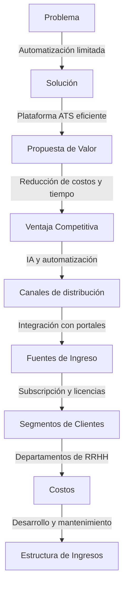
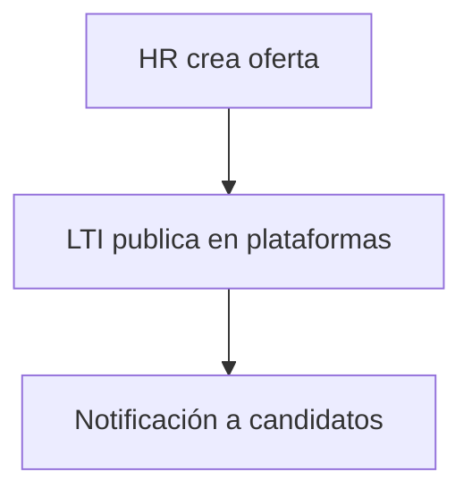
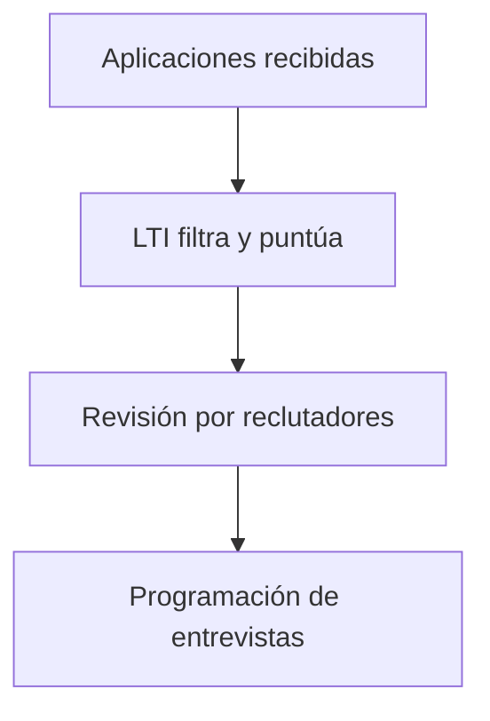
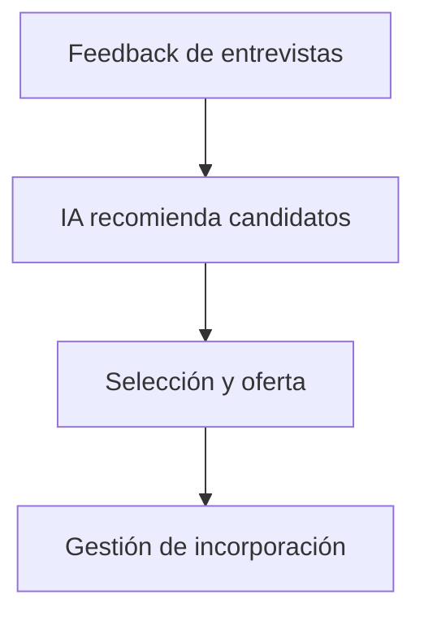
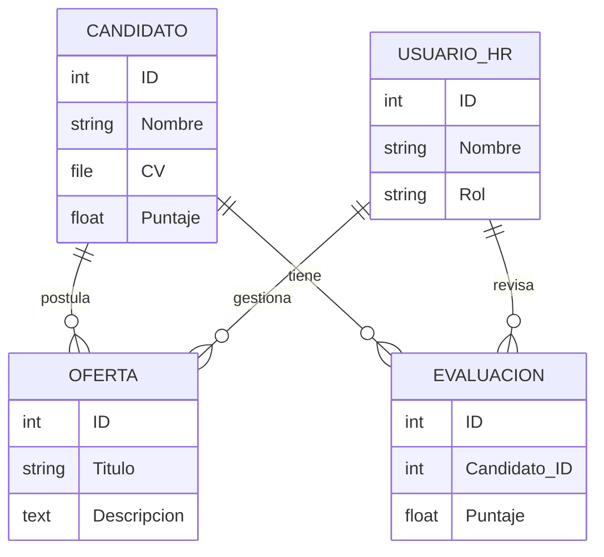
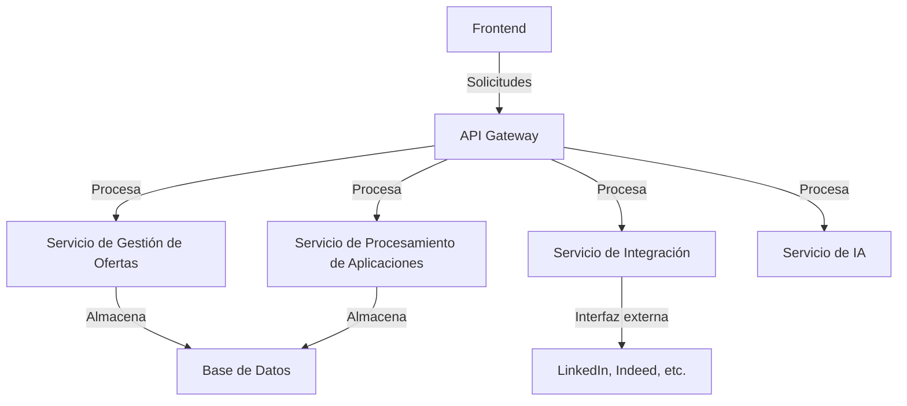
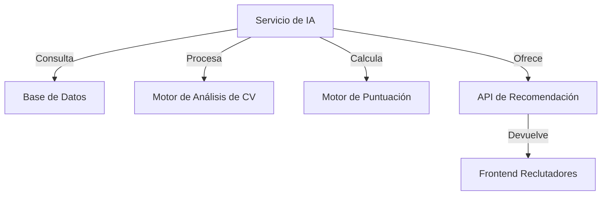

# LTI ATS: El Mejor Applicant-Tracking System

## Introducción
En un entorno empresarial donde la selección de talento es clave para el éxito, contar con un sistema eficiente que agilice los procesos de contratación es fundamental. LTI ATS es una plataforma innovadora diseñada para optimizar la gestión de candidatos, reducir tiempos de selección y mejorar la toma de decisiones mediante la automatización y la inteligencia artificial. En este documento, exploraremos sus funcionalidades clave, casos de uso principales, modelo de datos y diseño del sistema, destacando su capacidad para transformar el reclutamiento moderno.

## 1. Descripción del Software LTI
### Valor añadido y ventajas competitivas
LTI es un sistema de seguimiento de candidatos (ATS) diseñado para maximizar la eficiencia en los procesos de selección. Su enfoque innovador se basa en:
- **Automatización avanzada**: Reducción del trabajo manual mediante flujos de trabajo inteligentes.
- **Colaboración en tiempo real**: Comunicación fluida entre reclutadores y managers con notificaciones en vivo.
- **Asistencia de IA**: Recomendaciones de candidatos, análisis de CV y generación automática de respuestas.
- **Integraciones**: Conexión con plataformas de empleo, redes sociales y sistemas internos de HR.

### Funciones principales
- Creación y publicación de ofertas en múltiples plataformas.
- Recolección y análisis automático de aplicaciones.
- Filtros inteligentes y puntuación basada en IA.
- Evaluaciones y entrevistas automatizadas.
- Gestión de feedback y toma de decisiones colaborativa.
- Reportes y métricas en tiempo real.

### Lean Canvas

---

## 2. Casos de Uso Principales

### Caso 1: Publicación y gestión de ofertas de empleo

### Caso 2: Evaluación y selección de candidatos

### Caso 3: Decisión final y contratación

---

## 3. Modelo de Datos

---

## 4. Diseño del Sistema a Alto Nivel

---

## 5. Diagrama C4 en Profundidad

Se analizará en detalle el **Servicio de IA**, que gestiona el análisis y recomendación de candidatos.

### Niveles del Diagrama C4
1. **Nivel 1 - Contexto**: Representa cómo el Servicio de IA interactúa con otros sistemas dentro de LTI, como el servicio de gestión de ofertas y el de procesamiento de aplicaciones.
2. **Nivel 2 - Contenedores**: Muestra la división en microservicios dentro del Servicio de IA, incluyendo módulos de procesamiento de datos, modelos de machine learning y API de recomendación.
3. **Nivel 3 - Componentes**: Desglosa los módulos internos del Servicio de IA, como el analizador de CV, el motor de puntuación y la integración con bases de datos.
4. **Nivel 4 - Código (Opcional)**: Para desarrolladores, incluye detalles sobre frameworks, lenguajes y tecnologías utilizadas.

Con estos diagramas en Mermaid, se mejora la claridad y representación visual del sistema.

## Conclusión
LTI ATS representa una solución avanzada para la gestión del talento, proporcionando herramientas inteligentes para optimizar el proceso de selección de candidatos. Gracias a la automatización, la integración con múltiples plataformas y el uso de IA, permite a los equipos de RRHH reducir tiempos y mejorar la calidad de sus contrataciones. Con una arquitectura modular y un diseño eficiente, LTI está preparado para ser un referente en el mercado de los ATS, asegurando un reclutamiento más ágil, efectivo y basado en datos.

