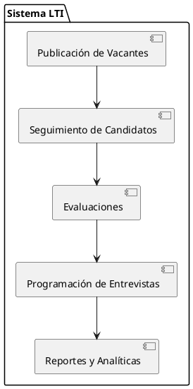
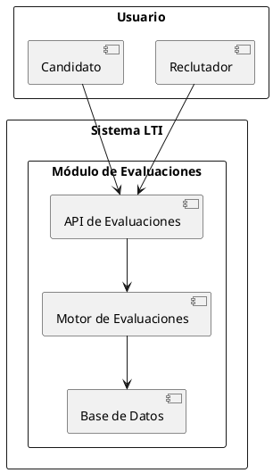

Por supuesto, a continuación se presenta el documento solicitado para LTI, la startup que desarrollará el Sistema de Gestión de Candidatos (ATS) del futuro.

**1. Descripción del Software**

LTI es un Sistema de Gestión de Candidatos (ATS) innovador diseñado para optimizar y agilizar el proceso de contratación en las empresas. Sus principales ventajas competitivas incluyen:

- **Inteligencia Artificial Avanzada**: Utiliza algoritmos de IA para filtrar y clasificar candidatos, asegurando una selección más precisa y eficiente.

- **Integración Multicanal**: Centraliza aplicaciones de diversas fuentes como portales de empleo, redes sociales y referencias internas, facilitando una gestión unificada.

- **Experiencia de Usuario Intuitiva**: Ofrece una interfaz amigable tanto para reclutadores como para candidatos, mejorando la interacción y reduciendo la curva de aprendizaje.

**Principales Funcionalidades:**

- **Gestión de Vacantes**: Creación y publicación de ofertas de trabajo en múltiples plataformas.

- **Seguimiento de Candidatos**: Monitoreo del progreso de los candidatos a lo largo del proceso de selección.

- **Evaluaciones Personalizadas**: Herramientas para crear y administrar pruebas y evaluaciones específicas para cada puesto.

- **Programación de Entrevistas**: Calendario integrado para coordinar y programar entrevistas con notificaciones automáticas.

- **Informes y Análisis**: Generación de informes detallados sobre métricas clave del proceso de contratación.

**Lean Canvas:**

| **Segmentos de Clientes**             | **Propuesta de Valor**                                                                 |
|---------------------------------------|-----------------------------------------------------------------------------------------|
| - Empresas medianas y grandes         | - Optimización del proceso de contratación mediante IA                                  |
| - Agencias de reclutamiento           | - Integración multicanal para una gestión centralizada                                  |
| - Startups en crecimiento             | - Interfaz intuitiva que mejora la experiencia del usuario                              |

| **Canales**                           | **Relación con Clientes**                                                               |
|---------------------------------------|-----------------------------------------------------------------------------------------|
| - Ventas directas                     | - Soporte personalizado durante la implementación                                       |
| - Marketing digital                   | - Atención al cliente 24/7                                                              |
| - Asociaciones con consultoras HR     | - Actualizaciones periódicas basadas en feedback                                        |

| **Fuentes de Ingresos**               | **Recursos Clave**                                                                      |
|---------------------------------------|-----------------------------------------------------------------------------------------|
| - Suscripción mensual/anual           | - Equipo de desarrollo de software                                                      |
| - Servicios de consultoría            | - Especialistas en IA y análisis de datos                                               |
| - Integraciones premium               | - Equipo de soporte al cliente                                                          |

| **Actividades Clave**                 | **Socios Clave**                                                                        |
|---------------------------------------|-----------------------------------------------------------------------------------------|
| - Desarrollo continuo del software    | - Plataformas de empleo y redes sociales                                                |
| - Investigación y mejora de algoritmos| - Proveedores de servicios de evaluación de candidatos                                  |
| - Estrategias de marketing y ventas   | - Consultoras de recursos humanos                                                       |

| **Estructura de Costos**              | **Métricas Clave**                                                                      |
|---------------------------------------|-----------------------------------------------------------------------------------------|
| - Desarrollo y mantenimiento de software| - Tasa de conversión de candidatos                                                      |
| - Gastos de marketing y ventas        | - Tiempo promedio de contratación                                                       |
| - Costos de soporte y atención al cliente| - Satisfacción del cliente                                                              |

**2. Casos de Uso Principales y Diagramas UML**

A continuación, se describen los tres casos de uso principales del software, acompañados de sus respectivos diagramas UML.

**Caso de Uso 1: Publicación de una Vacante**

*Descripción*: El reclutador crea y publica una nueva oferta de trabajo en múltiples plataformas desde el sistema.

*Diagrama UML*:

```plaintext
[Reclutador] --> (Crear Vacante)
(Crear Vacante) --> (Publicar en Plataformas)
```

**Caso de Uso 2: Evaluación de Candidatos**

*Descripción*: El reclutador evalúa a los candidatos mediante pruebas personalizadas y registra los resultados en el sistema.

*Diagrama UML*:

```plaintext
[Reclutador] --> (Crear Evaluación)
[Reclutador] --> (Asignar Evaluación a Candidato)
[Candidato] --> (Completar Evaluación)
[Reclutador] --> (Revisar Resultados)
```

**Caso de Uso 3: Programación de Entrevistas**

*Descripción*: El reclutador programa entrevistas con los candidatos seleccionados y envía notificaciones automáticas.

*Diagrama UML*:

```plaintext
[Reclutador] --> (Seleccionar Candidato)
[Reclutador] --> (Programar Entrevista)
[Reclutador] --> (Enviar Notificación)
[Candidato] --> (Recibir Notificación)
```

**3. Diagrama Entidad-Relación (E/R) del Modelo de Datos**

A continuación, se presenta el diagrama E/R que cubre el modelo de datos del software:

**Entidades y Atributos:**

- **Reclutador**:
  - ID_Reclutador (int, PK)
  - Nombre (varchar)
  - Email (varchar)
  - Teléfono (varchar)

- **Vacante**:
  - ID_Vacante (int, PK)
  - Título (varchar)
  - Descripción (text)
  - Fecha_Publicación (date)
  - ID_Reclutador (int, FK)

- **Candidato**:
  - ID_Candidato (int, PK)
  - Nombre (varchar)
  - Email (varchar)
  - Teléfono (varchar)
  - CV (blob)

- **Evaluación**:
  - ID_Evaluación (int, PK)
  - Nombre (varchar)
  - Descripción (text)
  - ID_Vacante (int, FK)

- **Resultado_Evaluación**:
  - ID_Resultado (int, PK)
  - ID_Evaluación (int, FK)
  - ID_Candidato (int, FK)
  - Puntuación (int)

- **Entrevista**:
  - ID_Entrevista (int, PK)
  - Fecha_Hora (datetime)
  - ID_Candidato (int, FK)
  - ID_Reclutador (int, FK)

**Relaciones:**

- Un **Reclutador** puede crear múltiples **Vacantes**.
- Una **Vacante** puede tener varias **Evaluaciones**.
- Un **Candidato** puede aplicar a múltiples **Vacantes**.
- Un **Candidato** puede tener varios **Resultados_Evaluación**.
- Un **Reclutador** puede programar varias **Entrevistas** con diferentes **Candidatos**.

---

**4. Explicación del Sistema a Alto Nivel**

LTI es un ATS diseñado para agilizar el proceso de selección y contratación mediante automatización e inteligencia artificial. El sistema opera bajo la siguiente arquitectura:

1. **Módulo de Publicación de Vacantes**: Permite a los reclutadores crear, modificar y publicar ofertas de trabajo en diversas plataformas.
2. **Módulo de Seguimiento de Candidatos**: Proporciona herramientas para monitorear el progreso de los postulantes en cada etapa del proceso.
3. **Módulo de Evaluaciones**: Facilita la creación y administración de pruebas para los candidatos.
4. **Módulo de Programación de Entrevistas**: Automatiza la coordinación de entrevistas con integración de calendarios.
5. **Módulo de Reportes y Analíticas**: Genera informes sobre el desempeño del proceso de selección.

**Diagrama de Alto Nivel:**



---

**5. Diagrama C4: Profundización en un Componente del Sistema**

Para ilustrar la arquitectura en detalle, analizaremos el **Módulo de Evaluaciones** a nivel C4:

1. **Contexto**: El Módulo de Evaluaciones interactúa con reclutadores, candidatos y bases de datos para administrar pruebas.
2. **Contenedores**: Incluye una API REST, una interfaz web y un servicio de almacenamiento para resultados.
3. **Componentes**:
   - API de Evaluaciones: Gestiona la creación, asignación y revisión de evaluaciones.
   - Motor de Evaluaciones: Automatiza la calificación de pruebas.
   - Base de Datos: Almacena información sobre evaluaciones y resultados.
4. **Código**: Implementado en un microservicio con Node.js y MongoDB.

**Diagrama C4 Representativo:**



---

Este documento proporciona una visión integral del sistema ATS de LTI, detallando sus funcionalidades, arquitectura y modelo de datos.

