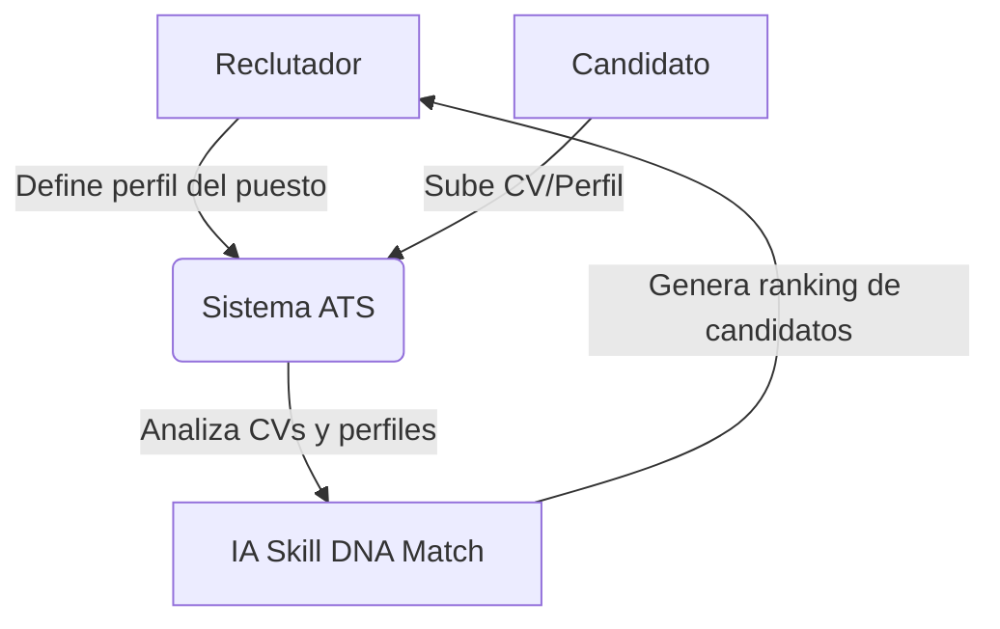
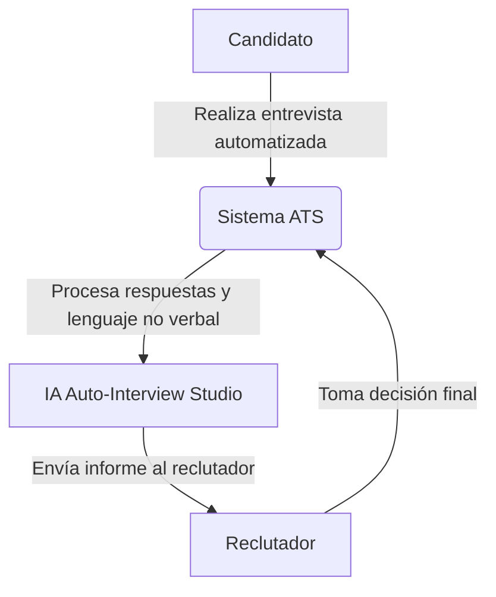
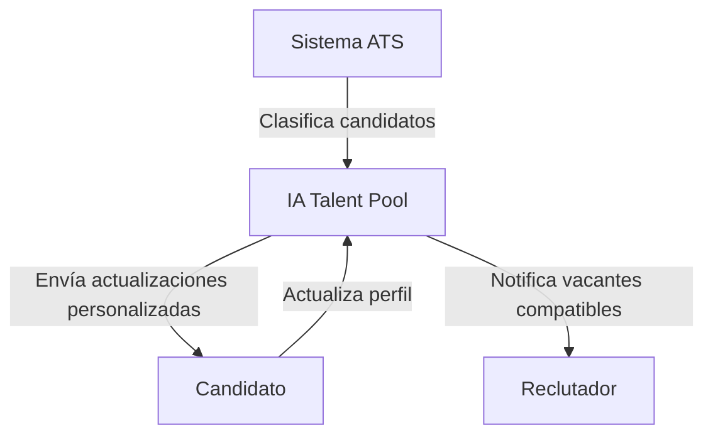
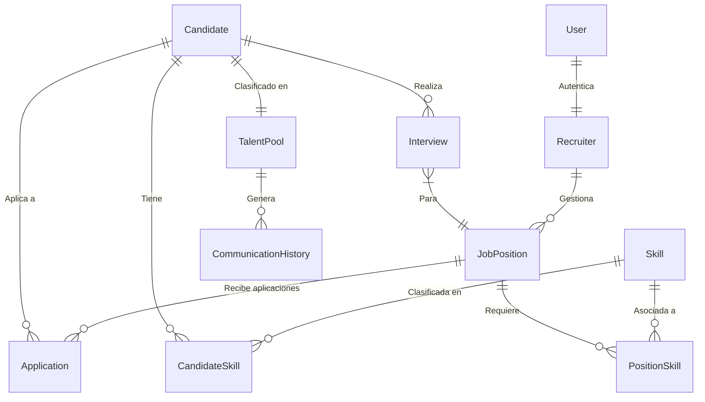
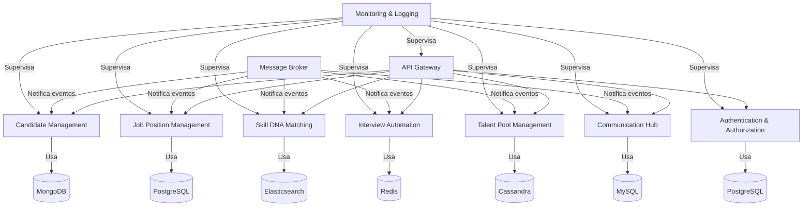
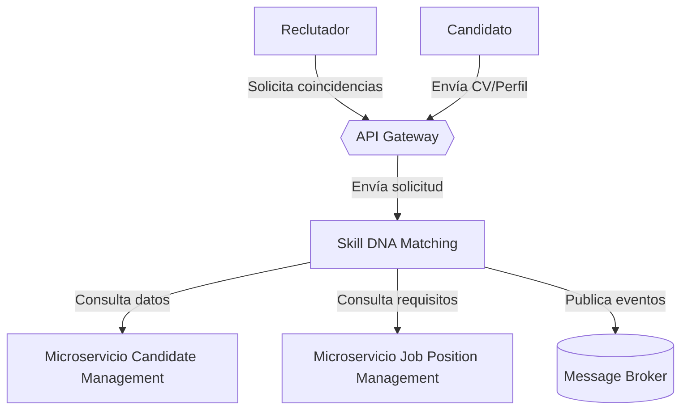
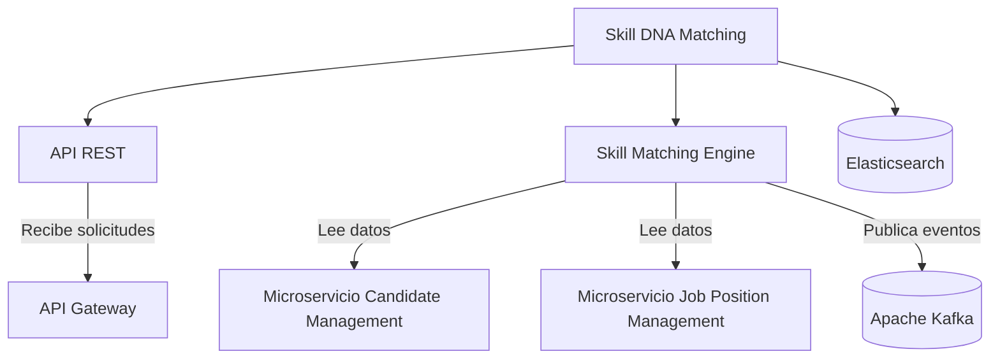
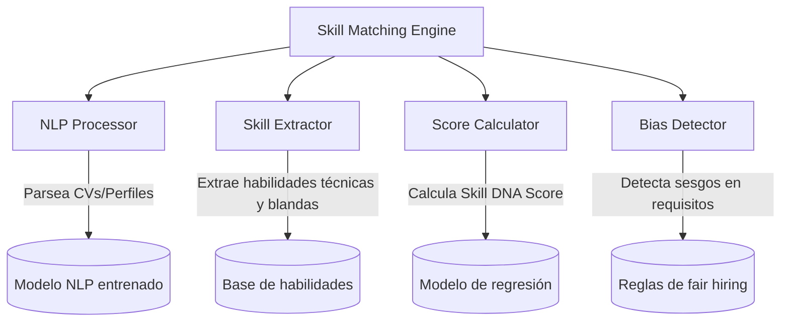
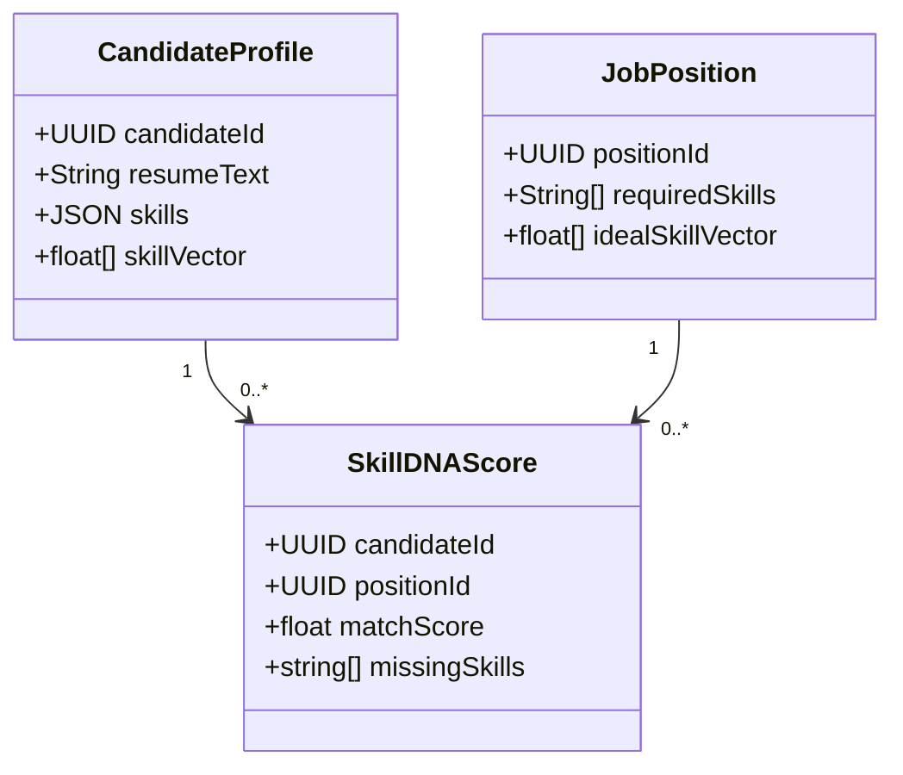

### **Descripción del Sistema ATS de LTI**  
El **ATS de LTI** es una plataforma innovadora que combina automatización avanzada de IA con herramientas intuitivas para revolucionar la gestión del reclutamiento. Su núcleo se basa en algoritmos de aprendizaje automático (ML) y procesamiento de lenguaje natural (NLP) para analizar candidatos, predecir su éxito en roles específicos y eliminar sesgos inconscientes. A diferencia de los sistemas tradicionales, el ATS de LTI prioriza la **eficiencia extrema** (reduciendo un 50% el tiempo de contratación) y la **toma de decisiones basada en datos**, integrando además herramientas colaborativas en tiempo real para equipos de contratación remotos o híbridos.

---

### **Ventajas Competitivas Clave**  
1. **IA Predictiva**:  
   - Analiza historiales de contratación exitosa para sugerir candidatos ideales, incluso aquellos pasivos (no buscando activamente empleo).  
   - Predice la retención a largo plazo mediante modelos de comportamiento.  
2. **Automatización Profunda**:  
   - Chatbots de reclutamiento con NLP avanzado para entrevistas preliminares y feedback en tiempo real.  
   - Programación automática de entrevistas sincronizada con calendarios de equipos y candidatos.  
3. **Reducción de Sesgos**:  
   - Escáner de IA para detectar sesgos en descripciones de empleo y evaluaciones de candidatos.  
   - Enmascara datos sensibles (género, edad, etnia) durante las primeras fases de selección.  
4. **Integración Omnicanal**:  
   - Conecta con LinkedIn, GitHub, portfolios digitales, y plataformas de freelance (Upwork, Fiverr) para captar talento no tradicional.  

---

### **Funciones Principales (Diferenciadores)**  
| Función | Detalle |  
|---------|---------|  
| **Resume++** | IA que analiza CVs y perfiles en redes sociales, extrayendo habilidades técnicas y blandas, incluso inferiendo competencias no declaradas. |  
| **Skill DNA Match** | Asigna un "ADN de habilidades" a cada candidato, comparándolo con el perfil ideal del puesto usando datos históricos de la empresa. |  
| **Auto-Interview Studio** | Genera entrevistas técnicas automatizadas con desafíos personalizados (ej: coding en vivo para devs, simulaciones para ventas). Analiza respuestas, tono de voz y lenguaje corporal (en video). |  
| **Collaboration Hub** | Tableros interactivos donde reclutadores, managers y equipo pueden comentar, votar y rankear candidatos en tiempo real. |  
| **Talent Pool AI** | Base de datos inteligente que mantiene engagement con candidatos no seleccionados mediante emails personalizados y actualizaciones de empleo relevantes. |  

---

### **Lean Canvas para LTI ATS**  

| **Sección** | **Detalle** |  
|-------------|-------------|  
| **Problema** | - Procesos de contratación lentos (30+ días promedio).   - 75% de CVs no revisados por reclutadores.   - Sesgos inconscientes afectan diversidad.   - Altos costos por contratación fallida (hasta 150% del salario anual). |  
| **Solución** | Plataforma todo-en-uno que automatiza el 80% de tareas repetitivas, prioriza candidatos con IA predictiva y garantiza contrataciones libres de sesgos. |  
| **Métrica Clave** | - Tiempo promedio por contratación.   - % de diversidad en candidatos seleccionados.   - NPS de reclutadores y candidatos.   - Reducción de costo por contratación. |  
| **Propuesta Única de Valor** | **"Contrata al mejor talento, no al que más busca trabajo: Descubre candidatos ideales con IA predictiva y elimina sesgos en 1 clic."** |  
| **Ventaja Injusta** | - Patente pendiente del algoritmo **Skill DNA Match**.   - Alianza exclusiva con plataformas de evaluación técnica (ej: HackerRank).   - Base de datos de 10M+ perfiles de candidatos globales. |  
| **Segmentos Clientes** | - Startups tech que compiten por talento escaso.   - Empresas medianas con alto volumen de contratación (retail, logística).   - Equipos de HR en corporaciones enfocados en diversidad. |  
| **Canales** | - Growth hacking: Versión gratuita para PYMES con límite de vacantes.   - Webinars con influencers de HR (ej: LinkedIn Top Voices).   - Acuerdos con consultoras de reclutamiento y bootcamps tech. |  
| **Estructura Costos** | - Desarrollo y entrenamiento de modelos de IA.   - Servidores cloud para procesamiento masivo de datos.   - Equipo comercial especializado en HR Tech. |  
| **Flujos Ingreso** | - Suscripción mensual (SaaS) por usuario.   - Pago por éxito: % del salario al cerrar contrataciones de alto nivel.   - Marketplace de integraciones (ej: plugins para SAP SuccessFactors). |  

---

### **Estrategia de Lanzamiento**  
1. **Fase Beta**: Acuerdos piloto con 20 startups (feedback para ajustar UX).  
2. **Virality**: Función de "Invita a tu candidato rechazado a otra empresa de nuestra red" (win-win).  
3. **Enterprise Tier**: Personalización de modelos de IA con datos históricos de cada empresa.  

El ATS de LTI no es solo una herramienta, sino un **ecosistema inteligente** que aprende de cada interacción, posicionándose como el cerebro de la contratación moderna. 🚀

Aquí tienes una descripción detallada de **3 casos de uso principales** del sistema ATS de LTI, junto con su diagrama de caso de uso en formato texto (usando sintaxis de Mermaid.js para que puedas generarlo visualmente en herramientas como [Mermaid Live Editor](https://mermaid-js.github.io/mermaid-live-editor/)).

---

### **1. Caso de Uso: Selección Automatizada de Candidatos con IA (Skill DNA Match)**  
**Actores Principales**: Reclutador, Sistema de IA.  
**Actores Secundarios**: Candidato.  

**Descripción**:  
El sistema analiza automáticamente CVs, perfiles en redes profesionales y portfolios para identificar coincidencias con el "ADN de habilidades" requerido por el puesto. Prioriza candidatos incluso si no cumplen el 100% de los requisitos tradicionales, pero tienen habilidades transferibles.  

**Flujo**:  
1. Reclutador carga la descripción del puesto y define parámetros (ej: "Python + liderazgo + pensamiento crítico").  
2. IA escanea bases de datos internas y externas (LinkedIn, GitHub) para encontrar candidatos.  
3. Sistema asigna un puntaje de coincidencia (Skill DNA Score) y envía una lista priorizada al reclutador.  
4. Reclutador revisa y selecciona candidatos para avanzar a la siguiente fase.  

**Diagrama de Caso de Uso**:  

---

### **2. Caso de Uso: Entrevista Automatizada con Análisis de Comportamiento**  
**Actores Principales**: Candidato, Sistema de IA.  
**Actores Secundarios**: Reclutador.  

**Descripción**:  
El sistema genera entrevistas técnicas o de comportamiento personalizadas (según el puesto) y analiza respuestas, tono de voz y lenguaje corporal (en video) para predecir compatibilidad cultural y habilidades blandas.  

**Flujo**:  
1. Candidato recibe un enlace para entrevista automatizada (ej: desafío de codificación en vivo o simulación de ventas).  
2. IA graba la sesión y analiza:  
   - **Técnico**: Exactitud de respuestas, tiempo de reacción.  
   - **Comportamiento**: Tono de voz, contacto visual, gestos (si es video).  
3. Sistema genera un informe con banderas verdes/amarillas/rojas y lo envía al reclutador.  
4. Reclutador decide si avanza a una entrevista final con el equipo.  

**Diagrama de Caso de Uso**:  

---

### **3. Caso de Uso: Gestión Inteligente de Talent Pool**  
**Actores Principales**: Sistema de IA, Candidato.  
**Actores Secundarios**: Reclutador.  

**Descripción**:  
El sistema clasifica automáticamente a candidatos no seleccionados en categorías reutilizables (ej: "Backend Junior", "Diseñador UX Senior") y mantiene engagement mediante comunicación personalizada, aumentando la probabilidad de contratación futura.  

**Flujo**:  
1. IA clasifica candidatos rechazados en el Talent Pool según habilidades, experiencia y feedback de entrevistas.  
2. Sistema envía emails automatizados con:  
   - Oportunidades de empleo relevantes.  
   - Cursos o certificaciones sugeridas para mejorar su perfil.  
   - Encuestas de satisfacción.  
3. Cuando surge un puesto compatible, el sistema notifica al reclutador y al candidato.  

**Diagrama de Caso de Uso**:  

---

### **Beneficios Clave en los Casos de Uso**  
1. **Reducción de tiempo**: Automatiza el 70% del proceso inicial de selección.  
2. **Precisión**: La IA identifica candidatos pasivos con mayor potencial que los activos.  
3. **Retención de talento**: El Talent Pool reduce costos de reclutamiento futuro en un 40%.  

Estos casos de uso reflejan cómo LTI integra IA no como un "extra", sino como el núcleo operativo, diferenciándose de ATS tradicionales que solo filtran CVs con palabras clave.

Aquí tienes el **modelo de datos** para el sistema ATS de LTI, estructurado en entidades, atributos y relaciones:

---

### **Entidades Principales y Atributos**  

#### **1. Candidate**  
- **CandidateID** (UUID, PK)  
- **Name** (String)  
- **Email** (String, Unique)  
- **Phone** (String)  
- **ResumePath** (String)  
- **LinkedInURL** (String)  
- **GitHubURL** (String)  
- **SkillDNAScore** (Float)  
- **Status** (Enum: "Active", "Rejected", "Hired", "TalentPool")  

#### **2. JobPosition**  
- **PositionID** (UUID, PK)  
- **Title** (String)  
- **Description** (Text)  
- **RequiredSkills** (JSON)  
- **Department** (String)  
- **Status** (Enum: "Open", "Closed", "OnHold")  
- **CreatedBy** (UUID, FK → Recruiter.RecruiterID)  
- **CreatedAt** (DateTime)  

#### **3. Recruiter**  
- **RecruiterID** (UUID, PK)  
- **Name** (String)  
- **Email** (String, Unique)  
- **Department** (String)  
- **Role** (Enum: "Admin", "Standard")  

#### **4. Skill**  
- **SkillID** (UUID, PK)  
- **Name** (String)  
- **Category** (Enum: "Technical", "Soft", "Leadership")  

#### **5. Interview**  
- **InterviewID** (UUID, PK)  
- **CandidateID** (UUID, FK → Candidate.CandidateID)  
- **PositionID** (UUID, FK → JobPosition.PositionID)  
- **Type** (Enum: "Automated", "Technical", "Cultural")  
- **ScoreTechnical** (Float)  
- **ScoreBehavior** (Float)  
- **VideoAnalysis** (JSON)  
- **Status** (Enum: "Completed", "Pending", "Canceled")  

#### **6. TalentPool**  
- **PoolID** (UUID, PK)  
- **CandidateID** (UUID, FK → Candidate.CandidateID)  
- **Category** (String)  
- **LastEngagementDate** (DateTime)  
- **RejectionReason** (Text)  

#### **7. CommunicationHistory**  
- **CommunicationID** (UUID, PK)  
- **CandidateID** (UUID, FK → Candidate.CandidateID)  
- **Type** (Enum: "Email", "Notification")  
- **Content** (Text)  
- **SentAt** (DateTime)  

#### **8. User** (Autenticación)  
- **UserID** (UUID, PK)  
- **Email** (String, Unique)  
- **PasswordHash** (String)  
- **RecruiterID** (UUID, FK → Recruiter.RecruiterID)  

---

### **Relaciones y Cardinalidad**  

| Relación | Entidades Involucradas | Tipo | Descripción |  
|----------|------------------------|------|-------------|  
| **Aplica a** | Candidate ↔ JobPosition | Many-to-Many | Un candidato puede aplicar a múltiples posiciones y viceversa. |  
| **Tiene habilidades** | Candidate ↔ Skill | Many-to-Many | Cada candidato tiene múltiples habilidades y cada habilidad puede pertenecer a múltiples candidatos. |  
| **Requiere habilidades** | JobPosition ↔ Skill | Many-to-Many | Cada posición requiere múltiples habilidades y cada habilidad puede ser requerida por múltiples posiciones. |  
| **Realiza entrevista** | Candidate → Interview | One-to-Many | Un candidato puede tener múltiples entrevistas. |  
| **Gestiona posición** | Recruiter → JobPosition | One-to-Many | Un reclutador puede crear múltiples posiciones. |  
| **Clasifica en TalentPool** | Candidate → TalentPool | One-to-One | Un candidato rechazado se clasifica en una categoría del Talent Pool. |  
| **Enviar comunicación** | TalentPool ↔ CommunicationHistory | One-to-Many | Un candidato en el Talent Pool puede recibir múltiples comunicaciones. |  

---

### **Tablas de Unión (Junction Tables)**  

#### **1. Application**  
- **ApplicationID** (UUID, PK)  
- **CandidateID** (UUID, FK → Candidate.CandidateID)  
- **PositionID** (UUID, FK → JobPosition.PositionID)  
- **ApplicationDate** (DateTime)  
- **Status** (Enum: "Pending", "Interview", "Rejected")  

#### **2. CandidateSkill**  
- **CandidateID** (UUID, FK → Candidate.CandidateID)  
- **SkillID** (UUID, FK → Skill.SkillID)  
- **Proficiency** (Enum: "Beginner", "Intermediate", "Expert")  

#### **3. PositionSkill**  
- **PositionID** (UUID, FK → JobPosition.PositionID)  
- **SkillID** (UUID, FK → Skill.SkillID)  
- **Importance** (Enum: "Required", "Preferred")  

#### **4. SkillDNAScore**  
- **ScoreID** (UUID, PK)  
- **CandidateID** (UUID, FK → Candidate.CandidateID)  
- **PositionID** (UUID, FK → JobPosition.PositionID)  
- **Score** (Float)  
- **AnalysisDate** (DateTime)  

---

### **Diagrama de Entidad-Relación Simplificado**  

---

### **Notas Clave del Modelo**  
1. **Flexibilidad en habilidades**: Las tablas `CandidateSkill` y `PositionSkill` permiten mapear competencias dinámicas, incluso aquellas inferidas por IA.  
2. **Trazabilidad completa**: `CommunicationHistory` registra todas las interacciones con candidatos, clave para cumplir normas de privacidad (GDPR).  
3. **Escalabilidad**: El uso de UUIDs evita colisiones en sistemas distribuidos y permite integración con microservicios.  
4. **Análisis de video**: El campo `VideoAnalysis` (JSON) almacena metadatos de IA como `"eyeContactScore": 0.87` o `"toneConsistency": "high"`.  

Este modelo soporta las funciones avanzadas de IA descritas (Skill DNA Match, Auto-Interview Studio) y permite escalar hacia integraciones con APIs externas (LinkedIn, HackerRank).

Aquí tienes el diseño de la **arquitectura de microservicios** para el sistema ATS de LTI, con bases de datos independientes para cada microservicio, una descripción detallada de cada componente y un diagrama de arquitectura.

---

### **Arquitectura de Microservicios**  

#### **1. Microservicio: Candidate Management**  
- **Responsabilidad**: Gestionar la información de los candidatos, incluyendo CVs, perfiles en redes sociales y habilidades.  
- **Bases de datos**: MongoDB (flexible para almacenar CVs y perfiles en JSON).  
- **Endpoints principales**:  
  - `POST /candidates`: Crear un nuevo candidato.  
  - `GET /candidates/{id}`: Obtener detalles de un candidato.  
  - `PUT /candidates/{id}/skills`: Actualizar habilidades de un candidato.  

#### **2. Microservicio: Job Position Management**  
- **Responsabilidad**: Gestionar las descripciones de puestos, requisitos y estado de las vacantes.  
- **Bases de datos**: PostgreSQL (estructurado para relaciones complejas entre puestos y habilidades).  
- **Endpoints principales**:  
  - `POST /positions`: Crear una nueva posición.  
  - `GET /positions/{id}`: Obtener detalles de una posición.  
  - `PUT /positions/{id}/status`: Actualizar el estado de una posición.  

#### **3. Microservicio: Skill DNA Matching**  
- **Responsabilidad**: Realizar el análisis de coincidencia de habilidades entre candidatos y puestos usando IA.  
- **Bases de datos**: Elasticsearch (ideal para búsquedas rápidas y análisis de texto).  
- **Endpoints principales**:  
  - `POST /match`: Calcular el Skill DNA Score para un candidato y puesto.  
  - `GET /matches/{positionId}`: Obtener candidatos mejor clasificados para una posición.  

#### **4. Microservicio: Interview Automation**  
- **Responsabilidad**: Gestionar entrevistas automatizadas, incluyendo análisis de video y respuestas.  
- **Bases de datos**: Redis (almacenamiento temporal de sesiones de entrevistas).  
- **Endpoints principales**:  
  - `POST /interviews`: Programar una entrevista automatizada.  
  - `GET /interviews/{id}/results`: Obtener resultados de una entrevista.  

#### **5. Microservicio: Talent Pool Management**  
- **Responsabilidad**: Clasificar y mantener engagement con candidatos no seleccionados.  
- **Bases de datos**: Cassandra (escalable para grandes volúmenes de datos).  
- **Endpoints principales**:  
  - `POST /talentpool`: Añadir un candidato al Talent Pool.  
  - `GET /talentpool/{category}`: Obtener candidatos por categoría.  

#### **6. Microservicio: Communication Hub**  
- **Responsabilidad**: Gestionar la comunicación automatizada con candidatos (emails, notificaciones).  
- **Bases de datos**: MySQL (estructurado para registros de comunicación).  
- **Endpoints principales**:  
  - `POST /notifications`: Enviar una notificación a un candidato.  
  - `GET /notifications/{candidateId}`: Obtener historial de comunicaciones.  

#### **7. Microservicio: Authentication & Authorization**  
- **Responsabilidad**: Gestionar autenticación y autorización de usuarios (reclutadores, administradores).  
- **Bases de datos**: PostgreSQL (para almacenar usuarios y roles).  
- **Endpoints principales**:  
  - `POST /auth/login`: Iniciar sesión.  
  - `GET /auth/validate`: Validar token de acceso.  

#### **8. API Gateway**  
- **Responsabilidad**: Centralizar y gestionar las solicitudes a los microservicios, incluyendo enrutamiento, autenticación y limitación de tasa.  
- **Tecnología**: Kong o Spring Cloud Gateway.  

#### **9. Message Broker (Event Bus)**  
- **Responsabilidad**: Facilitar la comunicación asíncrona entre microservicios (ej: notificar cuando un candidato es añadido al Talent Pool).  
- **Tecnología**: Apache Kafka o RabbitMQ.  

#### **10. Monitoring & Logging**  
- **Responsabilidad**: Supervisar el rendimiento del sistema y centralizar logs para diagnóstico.  
- **Tecnología**: Prometheus + Grafana (monitoreo), ELK Stack (Elasticsearch, Logstash, Kibana) para logs.  

---

### **Diagrama de Arquitectura**  

---

### **Flujo de Trabajo**  
1. Un reclutador inicia sesión a través del **API Gateway**, que valida sus credenciales con el microservicio de **Authentication & Authorization**.  
2. El reclutador crea una nueva posición en **Job Position Management**, que se almacena en PostgreSQL.  
3. Los candidatos aplican a la posición, y sus datos se almacenan en **Candidate Management** (MongoDB).  
4. El microservicio de **Skill DNA Matching** analiza las habilidades de los candidatos y las compara con los requisitos del puesto, almacenando resultados en Elasticsearch.  
5. Los candidatos mejor clasificados son invitados a una entrevista automatizada gestionada por **Interview Automation** (Redis).  
6. Los candidatos no seleccionados se añaden al **Talent Pool Management** (Cassandra), y se les envía comunicación automatizada a través de **Communication Hub** (MySQL).  
7. Todos los eventos (ej: nueva aplicación, entrevista completada) se publican en el **Message Broker** para que otros microservicios reaccionen (ej: notificar al reclutador).  
8. **Monitoring & Logging** supervisa el rendimiento del sistema y centraliza logs para diagnóstico.  

---

### **Ventajas de esta Arquitectura**  
- **Escalabilidad**: Cada microservicio puede escalar independientemente según la carga.  
- **Resiliencia**: Fallos en un microservicio no afectan a los demás.  
- **Flexibilidad**: Cada microservicio puede usar la base de datos y tecnología más adecuada.  
- **Mantenibilidad**: Actualizaciones y despliegues independientes para cada microservicio.  

Este diseño asegura que el ATS de LTI sea **altamente eficiente, escalable y preparado para integrar IA** de manera modular. 🚀

Aquí tienes un **diagrama C4** (Context, Containers, Components) para el microservicio **Skill DNA Matching**, detallando su arquitectura interna y relaciones:

---

### **Diagrama C4 - Skill DNA Matching**  
*(Usa [Mermaid Live Editor](https://mermaid-js.github.io/mermaid-live-editor/) para visualizar)*  

#### **Nivel 1: Contexto**  

**Descripción**:  
El microservicio **Skill DNA Matching** recibe solicitudes del API Gateway para encontrar candidatos ideales. Interactúa con otros microservicios para obtener datos de candidatos y puestos, y publica eventos de coincidencias en el Message Broker.

---

#### **Nivel 2: Contenedores**  

**Componentes principales**:  
1. **API REST**: Expone endpoints para calcular y obtener coincidencias.  
2. **Skill Matching Engine**: Motor de IA que ejecuta algoritmos de ML/NLP.  
3. **Elasticsearch**: Almacena perfiles de candidatos indexados para búsquedas rápidas.  

---

#### **Nivel 3: Componentes Internos (Skill Matching Engine)**  

**Flujo de procesamiento**:  
1. **NLP Processor**: Extrae texto de CVs y perfiles (PDF, LinkedIn, GitHub).  
2. **Skill Extractor**: Identifica habilidades usando técnicas de NER (*Named Entity Recognition*).  
3. **Score Calculator**: Compara habilidades del candidato con las requeridas por el puesto.  
4. **Bias Detector**: Escanea requisitos del puesto para detectar lenguaje no inclusivo.  

---

### **Modelos de Datos Clave**  

- **CandidateProfile**: Vector de habilidades generado por IA (ej: `[0.8, 0.3, 0.9]` para Python, Liderazgo, React).  
- **JobPosition**: Vector ideal del puesto, basado en empleados top históricos de la empresa.  
- **SkillDNAScore**: Resultado de la comparación entre ambos vectores usando similitud coseno.  

---

### **Tecnologías Clave**  
| Componente | Tecnologías |  
|------------|-------------|  
| **API REST** | Python/Node.js + FastAPI/Express |  
| **Skill Matching Engine** | TensorFlow/PyTorch + spaCy/NLTK |  
| **Base de datos** | Elasticsearch (índices para búsqueda semántica) |  
| **Comunicación** | Eventos asíncronos via Apache Kafka |  

---

### **Escenarios de Uso**  
1. **Coincidencia en tiempo real**:  
   - Cuando un candidato aplica a un puesto, el motor calcula su Skill DNA Score en <500ms.  
2. **Búsqueda proactiva**:  
   - Escanea bases de datos externas (GitHub, Behance) para encontrar candidatos pasivos con alta coincidencia.  
3. **Ajuste dinámico**:  
   - Recalcula scores si un candidato actualiza su perfil o se modifican los requisitos del puesto.  

---

Este diseño asegura que el **Skill DNA Matching** sea escalable (maneja >1M de perfiles), modular (permite añadir nuevos modelos de ML) y ético (integra controles de sesgo automatizados). 🧠🔍