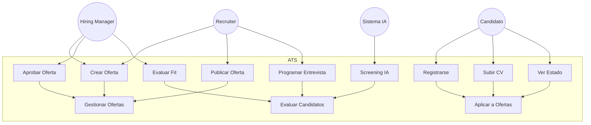
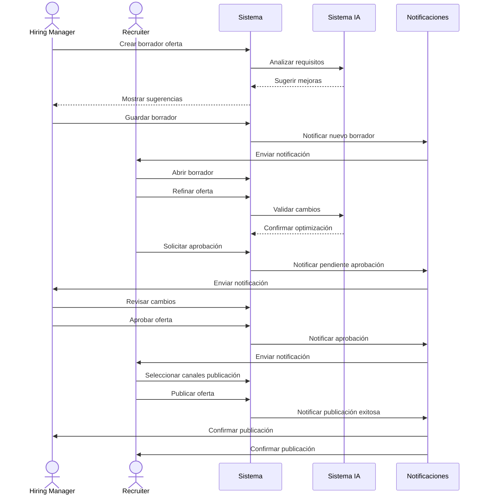
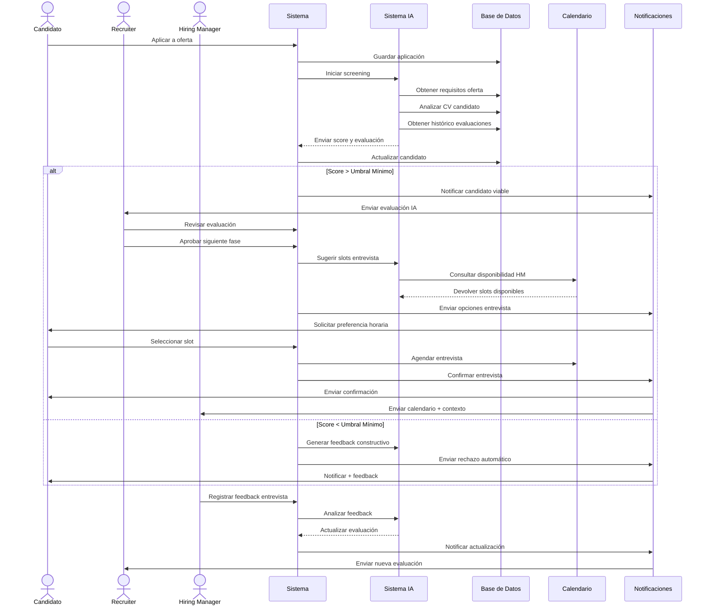
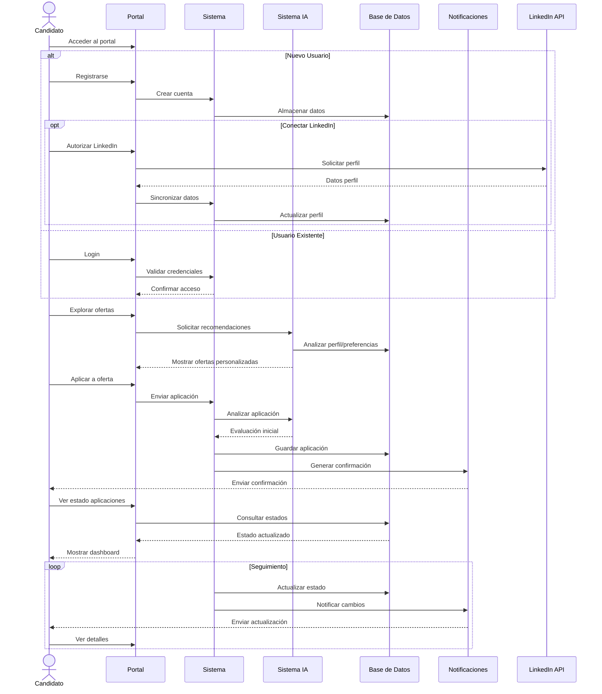
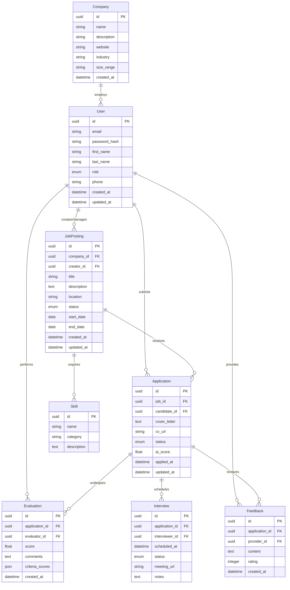
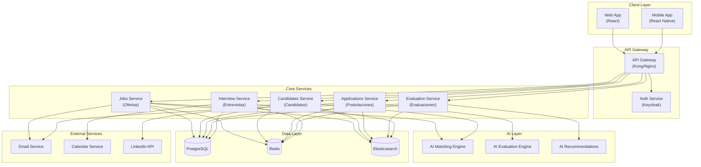
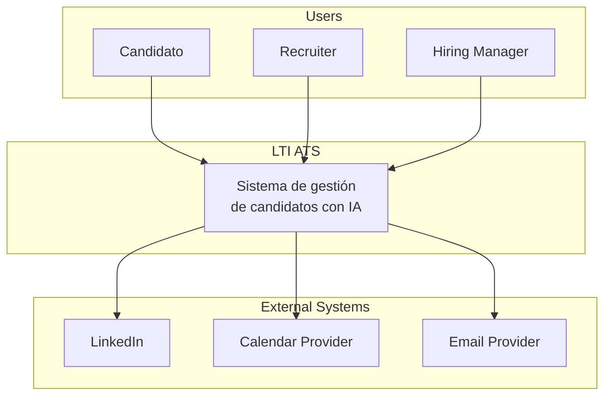
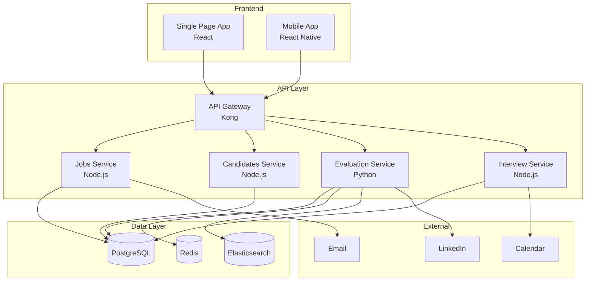
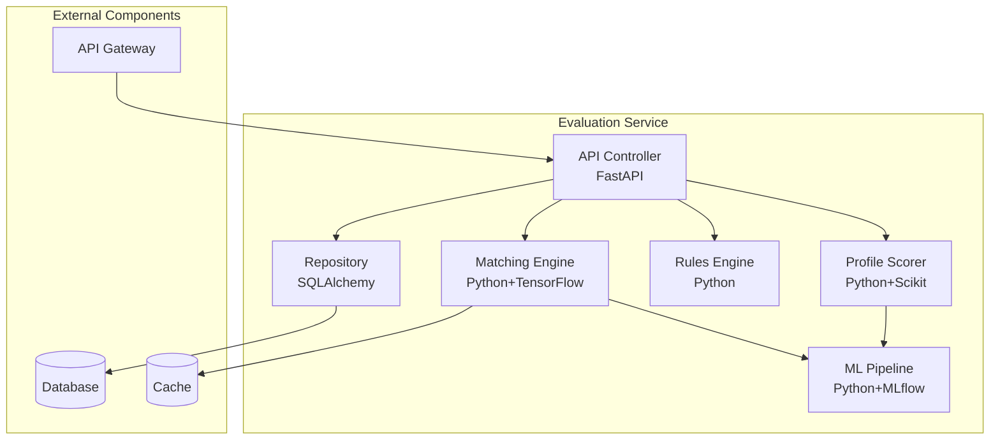

# 1. Descripción breve del software LTI, valor añadido y ventajas competitivas. Explicación de las funciones principales. Añadir un diagrama Lean Canvas para entender el modelo de negocio.

LTI es un Applicant Tracking System (ATS) de nueva generación que revoluciona el proceso de contratación aprovechando la inteligencia artificial. Diseñado para equipos de reclutamiento modernos, LTI automatiza las tareas repetitivas, facilita la colaboración en tiempo real entre recruiters y managers, y proporciona insights basados en datos para mejorar la calidad de las contrataciones.

Características clave:

- Automatización end-to-end del proceso usando IA avanzada
- Colaboración en tiempo real con herramientas integradas de comunicación
- Experiencia de candidato moderna y personalizada
- Analytics predictivos para mejorar la calidad de contratación
- API extensible para integración con otras herramientas de RRHH

El sistema reduce el tiempo de contratación hasta en un 50% mientras mejora la calidad de las contrataciones y la experiencia tanto del equipo de recruiting como de los candidatos.

<table>
  <tr>
    <th>1. PROBLEMA
      <ul>
        <li>Procesos manuales lentos y repetitivos en reclutamiento</li>
        <li>Descoordinación entre recruiters y hiring managers</li>
        <li>Pérdida de candidatos por mala experiencia</li>
        <li>Decisiones basadas en intuición, no en datos</li>
      </ul>
    </th>
    <th>2. SOLUCIÓN
      <ul>
        <li>Automatización IA end-to-end</li>
        <li>Hub de colaboración en tiempo real</li>
        <li>Portal de candidato moderno</li>
        <li>Analytics predictivos</li>
      </ul>
    </th>
    <th>3. PROPUESTA DE VALOR ÚNICA
      
ATS impulsado por IA que reduce el tiempo de contratación un 50% mientras mejora significativamente la calidad de las contrataciones y la experiencia de todos los stakeholders.

    </th>
  </tr>
  <tr>
    <td>4. VENTAJA COMPETITIVA
      <ul>
        <li>IA estado del arte</li>
        <li>UX moderna e intuitiva</li>
        <li>API extensible</li>
        <li>Automatización avanzada</li>
      </ul>
    </td>
    <td>5. SEGMENTOS DE CLIENTE
      <ul>
        <li>Empresas tech 50-500 empleados</li>
        <li>Startups en fase de crecimiento</li>
        <li>Equipos de recruiting ágiles</li>
      </ul>
    </td>
    <td>6. MÉTRICAS CLAVE
      <ul>
        <li>Time-to-hire</li>
        <li>Calidad de contrataciones</li>
        <li>NPS de candidatos</li>
        <li>Churn rate</li>
      </ul>
    </td>
  </tr>
  <tr>
    <td>7. CANALES
      <ul>
        <li>Venta directa B2B</li>
        <li>Partnerships con ATS legacy</li>
        <li>Marketplaces de RRHH</li>
      </ul>
    </td>
    <td>8. ESTRUCTURA DE COSTES
      <ul>
        <li>Desarrollo de producto</li>
        <li>Infraestructura cloud</li>
        <li>Customer Success</li>
        <li>Marketing & Ventas</li>
      </ul>
    </td>
    <td>9. FUENTES DE INGRESOS
      <ul>
        <li>Suscripción por usuario/mes</li>
        <li>Setup & Onboarding</li>
        <li>Servicios profesionales</li>
      </ul>
    </td>
  </tr>
</table>

# 2. Descripción de los 3 casos de uso principales, con el diagrama asociado a cada uno.
## Casos de uso y overview

1. Proceso de publicación y gestión de ofertas (hiring manager + recruiter)
2. Proceso de evaluación de candidatos con IA
3. Portal del candidato y proceso de aplicación

## Caso de uso 1: Proceso de publicación y gestión de ofertas (hiring manager + recruiter)

**Nombre:** Gestión de Ofertas

**Actores:**

- Hiring Manager (Principal)
- Recruiter (Principal)
- Sistema IA (Secundario)

**Precondiciones:**

Usuarios autenticados con roles correspondientes
Plantillas de ofertas disponibles

**Flujo Principal:**

1. Hiring Manager inicia creación de oferta

- Completa información básica (título, departamento, ubicación)
- Define requisitos técnicos y soft skills
- Sistema IA sugiere mejoras en tiempo real
- Guarda borrador

2. Recruiter refina la oferta

- Revisa y optimiza descripción
- Ajusta requisitos según mercado
- Añade información de beneficios y empresa
- Sistema IA valida contenido y SEO

3. Proceso de aprobación

- Recruiter solicita aprobación
- Hiring Manager recibe notificación
- Revisa cambios y aprueba
- Sistema notifica aprobación

4. Publicación

- Recruiter selecciona canales
- Sistema publica oferta
- Notifica a stakeholders

**Flujos Alternativos:**

- Hiring Manager solicita cambios en paso 3
- Oferta requiere aprobación adicional (ej: presupuesto)
- Publicación falla en algún canal

**Post-condiciones:**

- Oferta publicada en canales seleccionados
- Stakeholders notificados
- Sistema listo para recibir aplicaciones

## Caso de uso 2: Proceso de evaluación de candidatos con IA

### Descripción
Sistema de evaluación automatizada de candidatos que combina análisis de IA con supervisión humana para optimizar el proceso de selección.

### Actores
#### Principales
- Sistema IA
- Recruiter

#### Secundarios
- Hiring Manager
- Candidato

### Precondiciones
- Oferta de trabajo activa y publicada
- Modelo de IA entrenado con los requisitos específicos de la posición
- Criterios de evaluación y umbrales definidos
- Calendario de entrevistadores configurado

### Flujo Principal

#### 1. Screening Inicial
- Sistema recibe nueva aplicación del candidato
- IA realiza análisis del CV contra requisitos de la posición
- IA verifica histórico del candidato si existe en el sistema
- Sistema genera puntuación inicial y evaluación detallada

#### 2. Evaluación Automatizada
- Sistema verifica si la puntuación supera el umbral mínimo
- IA genera reporte de adecuación al puesto
- IA prepara sugerencias de preguntas para entrevista
- Sistema notifica resultados al recruiter

#### 3. Proceso de Entrevista
- Sistema calcula slots disponibles basados en calendarios
- Candidato selecciona horario preferido
- Sistema agenda entrevista automáticamente
- IA prepara briefing para el entrevistador con puntos clave

#### 4. Feedback y Decisión
- Hiring Manager registra evaluación post-entrevista
- IA analiza el feedback y actualiza la puntuación
- Sistema determina y notifica siguientes pasos
- IA genera comunicaciones personalizadas según resultado

### Flujos Alternativos

#### A1. Candidato No Cumple Umbral
1. Sistema detecta puntuación insuficiente
2. IA genera feedback constructivo personalizado
3. Sistema envía rechazo automático con feedback
4. Actualiza analytics del proceso

#### A2. Problemas con Entrevista
1. Candidato rechaza todos los slots propuestos
2. Sistema notifica al recruiter
3. Recruiter decide acción manual

#### A3. Evaluación Técnica Adicional
1. Hiring Manager solicita prueba técnica
2. Sistema selecciona prueba apropiada
3. IA ajusta evaluación incluyendo resultados

### Post-condiciones
- Evaluación del candidato completamente registrada
- Candidato notificado del estado/resultado
- Pipeline de contratación actualizado
- Métricas del proceso actualizadas en el sistema

### Requisitos Especiales
- Tiempo máximo de respuesta inicial: 1 hora
- Disponibilidad del sistema: 99.9%
- Cumplimiento GDPR/LOPD
- Trazabilidad completa del proceso

### Frecuencia
- Continua, según volumen de aplicaciones
- Picos esperados tras publicación de nuevas ofertas

## Notas
- El sistema debe mantener un nivel de humanización en las comunicaciones
- Las evaluaciones de IA deben ser auditables
- Se debe permitir override manual de decisiones automatizadas

## Caso de Uso 3: Portal del Candidato

### Descripción
Portal web que permite a los candidatos gestionar su proceso de búsqueda de empleo, desde el registro hasta el seguimiento de sus aplicaciones, proporcionando una experiencia personalizada y transparente.

### Actores
#### Principal
- Candidato

#### Secundarios
- Sistema IA
- Sistema de Notificaciones
- API LinkedIn

### Precondiciones
- Portal web operativo y accesible
- Sistema de autenticación funcionando
- Conexión con LinkedIn API configurada
- Ofertas activas en el sistema

### Flujo Principal

#### 1. Registro y Perfil
- Candidato accede al portal
- Crea cuenta o inicia sesión con email/LinkedIn
- Completa perfil profesional
- Sistema sincroniza datos con LinkedIn (opcional)
- IA analiza perfil para personalización

#### 2. Exploración de Ofertas
- Sistema muestra dashboard personalizado
- IA recomienda ofertas relevantes
- Candidato puede buscar y filtrar ofertas
- Sistema muestra match score por oferta

#### 3. Aplicación a Ofertas
- Candidato selecciona oferta
- Revisa requisitos y descripción
- Adjunta/actualiza CV específico
- Completa preguntas específicas
- Sistema confirma aplicación

#### 4. Seguimiento
- Candidato accede a su dashboard
- Visualiza estado de cada aplicación
- Recibe notificaciones de actualizaciones
- Gestiona próximos pasos (ej: entrevistas)

### Flujos Alternativos

#### A1. Registro con LinkedIn
1. Candidato elige "Conectar con LinkedIn"
2. Autoriza acceso a datos
3. Sistema pre-rellena perfil
4. Candidato verifica/completa información

#### A2. CV no Compatible
1. Sistema detecta formato no soportado
2. Muestra instrucciones de formato
3. Permite nuevo intento de subida

#### A3. Recuperación de Acceso
1. Candidato solicita reset de contraseña
2. Sistema verifica identidad
3. Envía instrucciones de recuperación

### Post-condiciones
- Perfil del candidato actualizado
- Aplicaciones registradas correctamente
- Notificaciones configuradas
- Analytics de uso actualizadas

### Requisitos Especiales
- Interfaz responsive (mobile-first)
- Tiempo de carga máximo: 2 segundos
- Accesibilidad WCAG 2.1
- Soporte multi-idioma
- Cumplimiento GDPR/LOPD

### Frecuencia
- Acceso continuo 24/7
- Picos durante horario laboral
- Aumentos tras publicación de nuevas ofertas

### Métricas Clave
- Tasa de registro completado
- Tiempo medio por aplicación
- Tasa de conversión (visitas/aplicaciones)
- NPS del portal
- Tasa de abandono

### Notas
- El diseño debe priorizar la experiencia de usuario
- Todas las acciones deben ser confirmadas
- Sistema debe mantener histórico de interacciones
- Feedback continuo del estado de las aplicaciones

# 3. Modelo de datos:

# 4. Diseño de Alto Nivel - LTI ATS

## Visión General
LTI ATS está diseñado como una plataforma cloud-native basada en microservicios, priorizando escalabilidad, mantenibilidad y capacidad de evolución independiente de cada componente.

## Capas del Sistema

### 1. Client Layer
- **Web Application**: SPA desarrollada en React para acceso desde navegador
- **Mobile Application**: App móvil en React Native para acceso en movilidad
- Ambas comparten lógica de negocio y componentes core

### 2. API Gateway
- **Gateway**: Punto único de entrada, manejo de routing y rate limiting
- **Auth Service**: Gestión de autenticación y autorización con Keycloak
- Implementa JWT para seguridad entre servicios

### 3. Core Services
Microservicios especializados:
- **Jobs Service**: Gestión de ofertas de trabajo
- **Candidates Service**: Gestión de perfiles de candidatos
- **Applications Service**: Gestión de postulaciones
- **Evaluation Service**: Motor de evaluaciones
- **Interview Service**: Gestión de entrevistas

### 4. AI Layer
Servicios especializados de IA:
- **Matching Engine**: Análisis de fit candidato-oferta
- **Evaluation Engine**: Evaluación automática de perfiles
- **Recommendations**: Sistema de recomendaciones personalizado

### 5. Data Layer
- **PostgreSQL**: Almacenamiento principal relacional
- **Redis**: Caché y gestión de sesiones
- **Elasticsearch**: Búsqueda avanzada y análisis de texto

### 6. External Services
Integraciones con servicios externos:
- **Email Service**: Notificaciones por correo
- **Calendar Service**: Gestión de agendas y entrevistas
- **LinkedIn API**: Integración con perfiles profesionales

## Aspectos Técnicos Clave

### Escalabilidad
- Servicios stateless para escalar horizontalmente
- Caché distribuida con Redis
- Load balancing a nivel de API Gateway

### Resiliencia
- Circuit breakers entre servicios
- Retry policies para operaciones fallidas
- Health checks y auto-healing

### Monitorización
- Distributed tracing
- Métricas de rendimiento
- Logs centralizados

### Seguridad
- Autenticación JWT
- Encryption en tránsito y reposo
- WAF en API Gateway

## Consideraciones de Implementación

### DevOps
- CI/CD automatizado
- Infraestructura como código
- Containerización con Docker
- Orquestación con Kubernetes

### Desarrollo
- API First approach
- Documentación automática con OpenAPI
- Testing automatizado en todas las capas

### Datos
- Migraciones automáticas
- Backups periódicos
- Estrategia de disaster recovery

## Próximos Pasos
1. MVP con servicios core
2. Iteración en capa de IA
3. Ampliación de integraciones
4. Optimización de rendimiento

# 5. Diagramas C4 para el componente: Evaluation Service

## Descripción
El Evaluation Service es el corazón del sistema de IA de LTI ATS. Se encarga de evaluar candidatos, realizar matching con ofertas y proporcionar recomendaciones basadas en datos.

## Componentes Principales

### API Controller
- Implementado en FastAPI
- Expone endpoints REST/gRPC
- Maneja autenticación y validación
- Coordina flujos de evaluación

### Matching Engine
- Core de IA para match candidato-oferta
- Utiliza TensorFlow para deep learning
- Análisis semántico de CVs y ofertas
- Scoring multidimensional

### Profile Scorer
- Evaluación objetiva de perfiles
- Modelos de ML para scoring
- Análisis de skills técnicos
- Predicción de fit cultural

### Rules Engine
- Implementa reglas de negocio
- Validaciones personalizables
- Filtros configurables
- Políticas de empresa

### ML Pipeline
- Gestión de modelos ML
- Entrenamiento automático
- Monitorización de rendimiento
- Versionado de modelos

### Repository
- Capa de acceso a datos
- Caché inteligente
- Queries optimizadas
- Transacciones ACID

## Tecnologías Clave
- Python 3.9+
- FastAPI
- TensorFlow/PyTorch
- SQLAlchemy
- Redis
- PostgreSQL

## Características
- Alta disponibilidad
- Escalado horizontal
- Procesamiento asíncrono
- Monitorización avanzada

## Diagrama C4 Nivel 1: Contexto

## Diagrama C4 Nivel 2: Contenedores

## Diagrama C4 Nivel 3: Componentes del Evaluation Service

