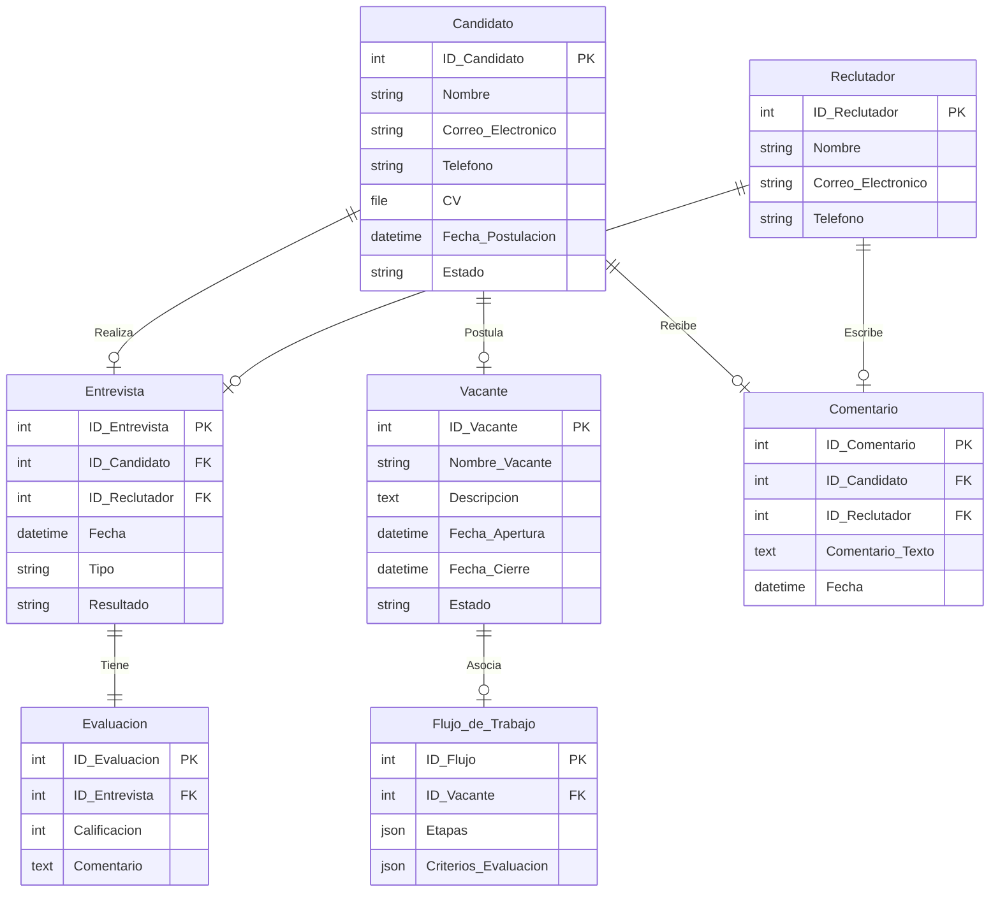

# Descripción del Producto - LTI Applicant-Tracking System (ATS)

## Descripción Breve
El **LTI ATS** es una plataforma moderna para gestionar el proceso de contratación de personal. Está diseñada para startups que buscan optimizar sus flujos de trabajo de selección de talento mediante una solución inteligente, ágil y centrada en el usuario. El sistema permitirá a los reclutadores gestionar las aplicaciones de los candidatos de manera eficiente, desde el momento en que envían su currículum hasta la contratación.

## Funciones Principales
- **Gestión de Candidatos**: Los reclutadores pueden ingresar, organizar y dar seguimiento a los perfiles de los candidatos, agregando notas y documentos relevantes en cada etapa del proceso.
- **Flujos de Trabajo Personalizados**: Creación de flujos de trabajo para las etapas del proceso de selección, adaptados a las necesidades de cada equipo o cliente.
- **Análisis Predictivo**: El sistema utiliza IA para analizar los perfiles de los candidatos y ofrecer recomendaciones basadas en patrones de contratación anteriores.
- **Integración con Plataformas de Empleo**: Sincronización de vacantes con portales de empleo populares (LinkedIn, Indeed, etc.).
- **Evaluación Colaborativa**: Permite a los reclutadores y miembros del equipo de contratación calificar y discutir a los candidatos en tiempo real.
- **Informes y Métricas**: Generación de informes detallados sobre la eficiencia del proceso de contratación, tiempos de respuesta y calidad de los candidatos.

## Valor Añadido
- **Optimización del Proceso de Contratación**: Mejora la eficiencia y la colaboración entre los reclutadores, lo que permite realizar contrataciones más rápidas.
- **Mejora de la Calidad de los Candidatos**: El análisis predictivo ayuda a seleccionar a los mejores candidatos basándose en datos previos, no solo en la experiencia superficial.
- **Adaptación a Startups**: La flexibilidad de personalización y escalabilidad permite a las startups crecer con el sistema sin necesidad de grandes inversiones.

## Ventajas Competitivas
- **IA para la Selección Predictiva**: A diferencia de otros ATS, LTI se centra en la inteligencia artificial para hacer recomendaciones sobre los candidatos que tienen mayor probabilidad de éxito.
- **Interfaz Intuitiva y Personalizable**: Los reclutadores pueden crear flujos de trabajo adaptados a sus necesidades sin perder tiempo en una interfaz compleja.
- **Alta Integración**: LTI se conecta de manera fluida con otras plataformas y servicios, como LinkedIn y otros sitios de empleo.

## Diagrama Lean Canvas

```mermaid
graph LR
    A[Problema] --> B[Segmento de Clientes]
    B --> C[Propuesta de Valor]
    C --> D[Canales]
    D --> E[Fuentes de Ingreso]
    E --> F[Recursos Clave]
    F --> G[Actividades Clave]
    G --> H[Socios Clave]
    H --> I[Estructura de Costos]

    A["Problema: Procesos de contratación largos y costosos"]
    B["Segmento de Clientes: Startups tecnológicas, Empresas pequeñas a medianas"]
    C["Propuesta de Valor: Optimización de procesos con IA y flujos personalizados"]
    D["Canales: Web, Integraciones con portales de empleo"]
    E["Fuentes de Ingreso: Suscripciones mensuales, Licencias por uso"]
    F["Recursos Clave: IA, Base de datos, Plataforma web"]
    G["Actividades Clave: Desarrollo de software, soporte al cliente, marketing"]
    H["Socios Clave: Plataformas de empleo, Proveedores de IA"]
    I["Estructura de Costos: Desarrollo, Infraestructura, Marketing"]
```



# Casos de Uso Principales del Sistema LTI ATS

A continuación se describen tres casos de uso fundamentales para el funcionamiento del ATS de LTI, cada uno con su respectivo diagrama en formato mermaid y una explicación detallada de las funcionalidades.

---

## Caso de Uso 1: Gestión de Candidatos

### Descripción
Este caso de uso permite a los reclutadores administrar la información de los candidatos. Las acciones incluyen:

- **Ingresar Candidato:** Registro de un nuevo candidato en el sistema.
- **Ver Perfil de Candidato:** Consulta de la información detallada del candidato, incluyendo currículum, experiencia, evaluaciones y notas.
- **Actualizar Información del Candidato:** Modificación de la información del candidato conforme se recaban nuevos datos.
- **Clasificar Candidato:** Organización de los candidatos en categorías o estados del proceso (por ejemplo, "Preseleccionado", "En espera" o "Rechazado").
- **Eliminar Candidato:** Remoción de candidatos que ya no son considerados en el proceso de selección.

### Diagrama de Caso de Uso

```mermaid
usecaseDiagram
    actor Reclutador as R
    R --> (Ingresar Candidato)
    R --> (Ver Perfil de Candidato)
    R --> (Actualizar Información del Candidato)
    R --> (Clasificar Candidato)
    R --> (Eliminar Candidato)
```

### Explicación Detallada
- **Ingresar Candidato:** El reclutador introduce datos básicos como nombre, correo, CV y otros documentos necesarios.
- **Ver Perfil de Candidato:** Se accede a toda la información recopilada del candidato, permitiendo una evaluación completa.
- **Actualizar Información del Candidato:** Conforme el proceso avanza, se añaden nuevos datos o se corrigen errores en el perfil del candidato.
- **Clasificar Candidato:** Organizar a los candidatos según su desempeño o etapa en el proceso para facilitar su seguimiento.
- **Eliminar Candidato:** Permite depurar la base de datos retirando candidatos que ya no son relevantes.

## Caso de Uso 2: Evaluación Colaborativa de Candidatos

### Descripción
Este caso de uso facilita la colaboración entre el reclutador y los miembros del equipo de contratación para evaluar de manera integral a los candidatos. Las funcionalidades clave incluyen:

- **Ver Evaluaciones:** El reclutador puede revisar todas las evaluaciones y comentarios aportados por el equipo.
- **Agregar Comentarios:** Los miembros del equipo pueden dejar observaciones y feedback sobre el desempeño del candidato.
- **Agregar Calificación:** Se asignan calificaciones basadas en criterios definidos para evaluar competencias y habilidades.
- **Tomar Decisión Final:** Con base en la información colaborativa, se decide si el candidato continúa en el proceso de selección.

### Diagrama de Caso de Uso
```mermaid
usecaseDiagram
    actor Reclutador as R
    actor MiembroEquipo as M
    R --> (Ver Evaluaciones)
    M --> (Agregar Comentarios)
    M --> (Agregar Calificación)
    R --> (Tomar Decisión Final)
```

### Explicación Detallada
- **Ver Evaluaciones:** El reclutador consulta un resumen consolidado de todas las evaluaciones, asegurando que todas las opiniones sean consideradas.
- **Agregar Comentarios:** Cada miembro del equipo añade detalles sobre las entrevistas, pruebas o interacciones con el candidato.
- **Agregar Calificación:** Se utilizan escalas o puntuaciones para medir objetivamente las habilidades del candidato.
- **Tomar Decisión Final:** Con la información recabada, se determina si el candidato avanza a la siguiente etapa o es descartado.

## Caso de Uso 3: Creación de Flujos de Trabajo Personalizados

### Descripción
Este caso de uso otorga la flexibilidad necesaria para adaptar el proceso de contratación a las necesidades específicas de cada vacante o empresa. Las funcionalidades incluyen:

- **Crear Flujo de Trabajo:** Configuración de un proceso de selección específico para una vacante determinada.
- **Agregar Etapas:** Definición de las diferentes fases del proceso, como entrevistas telefónicas, técnicas, pruebas prácticas, etc.
- **Definir Criterios de Evaluación:** Establecimiento de parámetros y métricas para evaluar el desempeño del candidato en cada etapa.
- **Establecer Condiciones de Avance:** Configuración de las condiciones que deben cumplirse para que un candidato pase de una etapa a otra.

### Diagrama de Caso de Uso
```mermaid
usecaseDiagram
    actor Reclutador as R
    R --> (Crear Flujo de Trabajo)
    R --> (Agregar Etapas)
    R --> (Definir Criterios de Evaluación)
    R --> (Establecer Condiciones de Avance)
```

### Explicación Detallada
- **Crear Flujo de Trabajo:** El reclutador inicia un nuevo proceso de selección adaptado a las necesidades de la vacante.
- **Agregar Etapas:** Se definen las fases que compondrán el proceso, permitiendo una estructuración clara y secuencial.
- **Definir Criterios de Evaluación:** Se establecen los parámetros que se utilizarán para medir el rendimiento y la idoneidad del candidato en cada fase.
- **Establecer Condiciones de Avance:** Se configuran reglas que determinan el paso a la siguiente etapa, asegurando que solo los candidatos que cumplen los criterios avancen.

# Modelo de Datos del Sistema LTI ATS

El modelo de datos de un sistema es crucial para garantizar que las relaciones entre las entidades sean claras y que los datos se gestionen de manera eficiente. A continuación, se presenta una descripción detallada del modelo de datos del sistema ATS de LTI, que incluye las entidades principales, sus atributos y las relaciones entre ellas. Este modelo cubre todas las entidades esenciales para gestionar el ciclo completo de contratación.

## 1. Explicación del Modelo de Datos

### Entidades y Atributos

1. **Candidato**
    - **ID_Candidato** (int): Identificador único del candidato.
    - **Nombre** (string): Nombre completo del candidato.
    - **Correo_Electronico** (string): Dirección de correo electrónico.
    - **Telefono** (string): Número de teléfono de contacto.
    - **CV** (file): Archivo del CV del candidato.
    - **Fecha_Postulacion** (datetime): Fecha en la que el candidato se postula a la vacante.
    - **Estado** (string): Estado del candidato (Ejemplo: "Preseleccionado", "Rechazado", "Contratado").

2. **Reclutador**
    - **ID_Reclutador** (int): Identificador único del reclutador.
    - **Nombre** (string): Nombre completo del reclutador.
    - **Correo_Electronico** (string): Dirección de correo electrónico del reclutador.
    - **Telefono** (string): Número de teléfono de contacto.

3. **Entrevista**
    - **ID_Entrevista** (int): Identificador único de la entrevista.
    - **ID_Candidato** (int): Relación con el Candidato.
    - **ID_Reclutador** (int): Relación con el Reclutador que realiza la entrevista.
    - **Fecha** (datetime): Fecha de la entrevista.
    - **Tipo** (string): Tipo de entrevista (Ejemplo: "Telefónica", "Presencial").
    - **Resultado** (string): Resultado de la entrevista (Ejemplo: "Aprobado", "Rechazado").

4. **Evaluacion**
    - **ID_Evaluacion** (int): Identificador único de la evaluación.
    - **ID_Entrevista** (int): Relación con la Entrevista.
    - **Calificacion** (int): Puntuación obtenida en la evaluación (escala de 1-10).
    - **Comentario** (text): Comentarios del reclutador sobre el candidato.

5. **Vacante**
    - **ID_Vacante** (int): Identificador único de la vacante.
    - **Nombre_Vacante** (string): Nombre del puesto a cubrir.
    - **Descripcion** (text): Descripción del puesto y requisitos.
    - **Fecha_Apertura** (datetime): Fecha de apertura de la vacante.
    - **Fecha_Cierre** (datetime): Fecha de cierre de la vacante.
    - **Estado** (string): Estado de la vacante (Ejemplo: "Abierta", "Cerrada", "En Proceso").

6. **Flujo de Trabajo**
    - **ID_Flujo** (int): Identificador único del flujo de trabajo.
    - **ID_Vacante** (int): Relación con la Vacante.
    - **Etapas** (json): Lista de etapas en el proceso de selección (Ejemplo: ["Entrevista inicial", "Entrevista técnica", "Entrevista final"]).
    - **Criterios_Evaluacion** (json): Criterios específicos para cada etapa de evaluación (Ejemplo: {"Entrevista inicial": "Comunicación", "Entrevista técnica": "Habilidades técnicas"}).

7. **Comentario**
    - **ID_Comentario** (int): Identificador único del comentario.
    - **ID_Candidato** (int): Relación con el Candidato.
    - **ID_Reclutador** (int): Relación con el Reclutador que deja el comentario.
    - **Comentario_Texto** (text): El texto del comentario.
    - **Fecha** (datetime): Fecha en que se dejó el comentario.

---

### Relaciones

- **Candidato → Entrevista**: Un candidato puede tener varias entrevistas. Relación 1:N.
- **Reclutador → Entrevista**: Un reclutador puede realizar varias entrevistas. Relación 1:N.
- **Entrevista → Evaluacion**: Una entrevista puede tener una evaluación. Relación 1:1.
- **Candidato → Comentario**: Un candidato puede tener múltiples comentarios de diferentes reclutadores. Relación 1:N.
- **Reclutador → Comentario**: Un reclutador puede dejar varios comentarios. Relación 1:N.
- **Vacante → Flujo de Trabajo**: Una vacante puede tener un flujo de trabajo asociado. Relación 1:1.
- **Candidato → Vacante**: Un candidato puede postularse a una vacante. Relación N:M (Un candidato puede postularse a varias vacantes y una vacante puede recibir postulaciones de múltiples candidatos).

---

## 2. Diagrama de Modelo de Datos (Mermaid)



# Diseño del Sistema a Alto Nivel del Software LTI ATS

El diseño a alto nivel de un sistema de software abarca la estructuración general de los componentes, su interacción y las tecnologías utilizadas. A continuación, se presenta el diseño a alto nivel del sistema ATS de LTI, destacando sus principales módulos, servicios y la arquitectura subyacente.

## 1. Descripción del Diseño

### Componentes Principales del Sistema

1. **Interfaz de Usuario (UI)**
    - La interfaz de usuario es responsable de la interacción entre los usuarios finales (reclutadores, candidatos, administradores) y el sistema.
    - Se compone de diversas vistas, incluyendo:
        - **Dashboard del Reclutador**: Muestra las vacantes, candidatos y procesos activos.
        - **Panel del Candidato**: Permite a los candidatos postularse a vacantes, actualizar su perfil y revisar el estado de sus aplicaciones.
        - **Administración**: Gestión de vacantes, flujos de trabajo y configuraciones del sistema.
    - **Tecnología**: HTML, CSS, JavaScript (React o Vue.js para una interfaz dinámica).

2. **Backend (API)**
    - El backend gestiona la lógica de negocio, la autenticación y las interacciones con la base de datos.
    - **Microservicios**: El sistema está diseñado para ser modular, utilizando microservicios que permiten escalar y mantener el sistema de manera eficiente.
    - Los principales microservicios incluyen:
        - **Autenticación y Autorización**: Gestiona el inicio de sesión, los roles de usuario y los permisos.
        - **Gestión de Candidatos**: Realiza la gestión de perfiles, postulaciones y seguimiento de candidatos.
        - **Gestión de Vacantes**: Administra las vacantes disponibles, los flujos de trabajo asociados y el seguimiento de las vacantes abiertas.
        - **Entrevistas y Evaluaciones**: Maneja el proceso de entrevistas, evaluaciones y la relación entre reclutadores y candidatos.
        - **Notificaciones**: Envío de correos electrónicos y notificaciones internas sobre cambios en el estado de los candidatos, entrevistas y vacantes.
    - **Tecnología**: Node.js, Express, o Python (Django, Flask).

3. **Base de Datos**
    - Se utiliza una base de datos relacional para almacenar los datos estructurados del sistema.
    - **Entidades**: Candidatos, Reclutadores, Vacantes, Entrevistas, Evaluaciones, Comentarios, Flujos de Trabajo, etc.
    - **Tecnología**: PostgreSQL o MySQL.

4. **Servicio de Correo**
    - Un servicio especializado para gestionar el envío de correos electrónicos y notificaciones.
    - **Tecnología**: Mailgun, SendGrid, o Amazon SES.

5. **Infraestructura en la Nube**
    - El sistema se despliega en la nube para garantizar escalabilidad, seguridad y disponibilidad.
    - **Tecnología**: AWS, Google Cloud o Azure.

6. **Autenticación**
    - El sistema implementa autenticación basada en JWT (JSON Web Tokens) para garantizar seguridad en la autenticación y autorización de usuarios.
    - **Tecnología**: OAuth2.0, JWT.

### Flujo General del Sistema

1. **Inicio de sesión y autorización**: El usuario (reclutador, candidato o administrador) ingresa al sistema a través de la UI. El sistema valida sus credenciales utilizando el microservicio de autenticación y autoriza el acceso según su rol.
2. **Interacción con el sistema**: Dependiendo del rol, el usuario accede a las funcionalidades correspondientes:
    - El reclutador puede gestionar vacantes, entrevistar candidatos, y realizar evaluaciones.
    - El candidato puede postularse a vacantes y seguir su progreso.
    - El administrador gestiona configuraciones globales y flujos de trabajo.
3. **Notificaciones**: El sistema envía correos electrónicos automáticos a los candidatos y reclutadores para notificar cambios importantes en las postulaciones, entrevistas y evaluaciones.
4. **Base de datos**: Todos los datos del sistema son almacenados y gestionados en la base de datos, desde perfiles de candidatos hasta vacantes y evaluaciones.

## 2. Diagrama del Sistema a Alto Nivel (Mermaid)

```mermaid
graph LR
    UI[Interfaz de Usuario] -->|Interacción| API[Backend (API)]
    API --> DB[Base de Datos]
    API -->|Autenticación| Auth[Microservicio de Autenticación]
    API -->|Gestión de Candidatos| Candidato[Microservicio de Candidatos]
    API -->|Gestión de Vacantes| Vacante[Microservicio de Vacantes]
    API -->|Entrevistas y Evaluaciones| Entrevista[Microservicio de Entrevistas y Evaluaciones]
    API -->|Notificaciones| Notificacion[Servicio de Correo]
    Auth -->|JWT| Token[JWT Tokens]
    
    UI -.->|Envío de Notificaciones| Notificacion
    Candidato -.->|Postulación| Vacante
    Entrevista -.->|Evaluación| Candidato
    Vacante -.->|Flujos de Trabajo| FlujoDeTrabajo[Microservicio de Flujos de Trabajo]
    
    subgraph Infraestructura
        DB
        API
    end
    subgraph Nube
        Infraestructura
    end
```

# Diagrama C4 en Profundidad: Microservicio de Autenticación

El diagrama C4 es una herramienta que permite representar visualmente la arquitectura de un sistema de software. En este caso, nos centraremos en el componente del **Microservicio de Autenticación**, que es uno de los elementos clave para la seguridad y la gestión de usuarios en el sistema ATS de LTI. A continuación se presenta el diagrama C4 que describe cómo funciona este microservicio y cómo interactúa con otros componentes del sistema.

## 1. Diagrama C4: Microservicio de Autenticación

### Diagrama de Nivel 1: Contexto

```mermaid
C4Context
    title Diagrama C4 de Microservicio de Autenticación - Contexto
    Person(reclutador, "Reclutador", "Interacción con el sistema ATS para gestionar vacantes y entrevistas")
    Person(candidato, "Candidato", "Accede al sistema ATS para postularse a vacantes y ver su progreso")
    System_Loft(system, "Sistema ATS", "Sistema de gestión de candidatos y vacantes")
    System_Ext(auth_service, "Servicio de Autenticación", "Microservicio que gestiona la autenticación y autorización de usuarios")
    
    System_Loft -> auth_service: "Solicita autenticación"
    auth_service -> reclutador: "Devuelve JWT (JSON Web Token)"
    auth_service -> candidato: "Devuelve JWT (JSON Web Token)"
```

### Diagrama de Nivel 2: Contenedores
```mermaid
C4Container
    title Diagrama C4 de Microservicio de Autenticación - Contenedores
    System_Boundary(system, "Sistema ATS") {
        Container(webapp, "Aplicación Web", "React", "Interfaz de usuario para reclutadores y candidatos")
        Container(api, "API Backend", "Node.js", "Backend que gestiona las solicitudes y datos")
        ContainerDb(db, "Base de Datos Relacional", "PostgreSQL", "Almacena los datos del sistema ATS")
    }
    
    Container(auth_service, "Microservicio de Autenticación", "Node.js + JWT", "Gestiona la autenticación y autorización de usuarios")
    
    webapp -> api: "Solicita autenticación"
    api -> auth_service: "Llama a microservicio de autenticación"
    auth_service -> db: "Consulta la base de datos para validar credenciales"
    auth_service -> webapp: "Devuelve JWT tras autenticación"
    api -> webapp: "Recibe token JWT y proporciona acceso a recursos"
```

### Diagrama de Nivel 3: Componentes del Microservicio de Autenticación
```mermaid
C4Component
    title Diagrama C4 de Microservicio de Autenticación - Componentes
    Container(auth_service, "Microservicio de Autenticación", "Node.js + JWT", "Gestiona la autenticación y autorización de usuarios") {
        Component(auth_controller, "Controlador de Autenticación", "Node.js", "Controla las solicitudes de autenticación")
        Component(auth_service_logic, "Lógica de Autenticación", "Node.js", "Gestiona la lógica para validar usuarios y generar tokens JWT")
        Component(auth_db, "Gestor de Base de Datos", "Node.js", "Realiza consultas a la base de datos para validar credenciales de usuario")
        Component(jwt_generator, "Generador de JWT", "Node.js", "Genera un token JWT para acceso posterior")
    }
    
    auth_controller -> auth_service_logic: "Solicita validación de usuario"
    auth_service_logic -> auth_db: "Consulta la base de datos"
    auth_service_logic -> jwt_generator: "Solicita generación de token JWT"
    jwt_generator -> auth_service_logic: "Devuelve token JWT"
    auth_service_logic -> auth_controller: "Devuelve validación y token"
    auth_controller -> webapp: "Devuelve respuesta al usuario"

```

### Diagrama de Nivel 4: Código del Componente Lógica de Autenticación
```mermaid
C4Code
    title Diagrama C4 de Microservicio de Autenticación - Lógica de Autenticación
    Component(auth_service_logic, "Lógica de Autenticación", "Node.js", "Gestiona la lógica para validar usuarios y generar tokens JWT") {
        Class(ValidateCredentials, "Validar Credenciales", "Node.js", "Componente que valida las credenciales del usuario en la base de datos")
        Class(GenerateJWT, "Generar Token JWT", "Node.js", "Componente que crea un JWT para el acceso posterior")
        Class(AuthenticateUser, "Autenticar Usuario", "Node.js", "Componente que integra la validación de credenciales y generación de token")
    }

    ValidateCredentials -> db: "Consulta la base de datos para validar usuario"
    AuthenticateUser -> ValidateCredentials: "Llama a Validar Credenciales"
    AuthenticateUser -> GenerateJWT: "Llama a Generar Token JWT"
    GenerateJWT -> AuthenticateUser: "Devuelve el token JWT"
```

## 2. Descripción Detallada
El microservicio de Autenticación es un componente clave en el sistema ATS de LTI, responsable de garantizar la seguridad del sistema mediante el control de acceso y la validación de usuarios. A continuación se explica cada componente y su interacción:

### Nivel 1: Contexto
El microservicio de autenticación interactúa con dos tipos de usuarios principales: Reclutadores y Candidatos. Ambos usuarios necesitan autenticarse en el sistema para acceder a sus funcionalidades personalizadas. El sistema ATS realiza solicitudes al microservicio de autenticación para validar las credenciales y generar un token JWT.

### Nivel 2: Contenedores
El microservicio de autenticación se encuentra como un servicio independiente dentro de la arquitectura, donde:

- Webapp (Frontend) solicita autenticación.
- API Backend comunica con el microservicio de autenticación.
- La base de datos contiene los usuarios registrados y las credenciales asociadas.

### Nivel 3: Componentes
El microservicio de autenticación está compuesto por los siguientes componentes:

- Controlador de Autenticación: Se encarga de recibir las solicitudes de autenticación.
- Lógica de Autenticación: Valida las credenciales del usuario y gestiona la lógica de autorización.
- Gestor de Base de Datos: Realiza las consultas necesarias para verificar las credenciales en la base de datos.
- Generador de JWT: Crea el token JWT necesario para la autenticación posterior.

### Nivel 4: Código
A nivel de código, la Lógica de Autenticación se encarga de validar las credenciales del usuario, consultar la base de datos, y generar un token JWT utilizando bibliotecas como jsonwebtoken en Node.js. La lógica de negocio para la autenticación está dividida en tres clases principales:

- Validar Credenciales: Verifica que las credenciales proporcionadas coincidan con los registros de la base de datos.
- Generar JWT: Crea un token JWT seguro para el usuario autenticado.
- Autenticar Usuario: Integra ambos componentes para proporcionar una experiencia de autenticación fluida.
