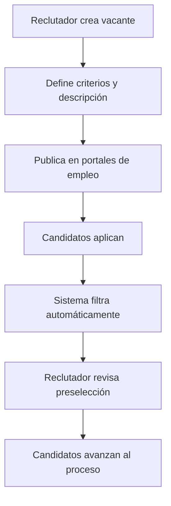
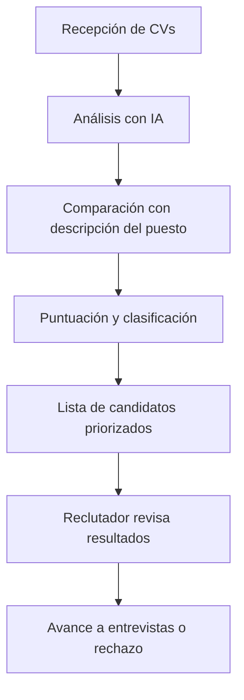
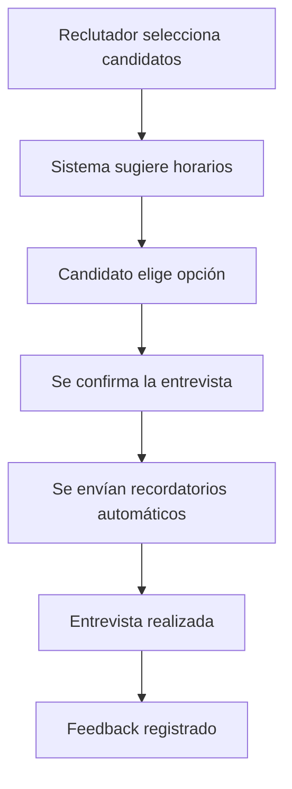
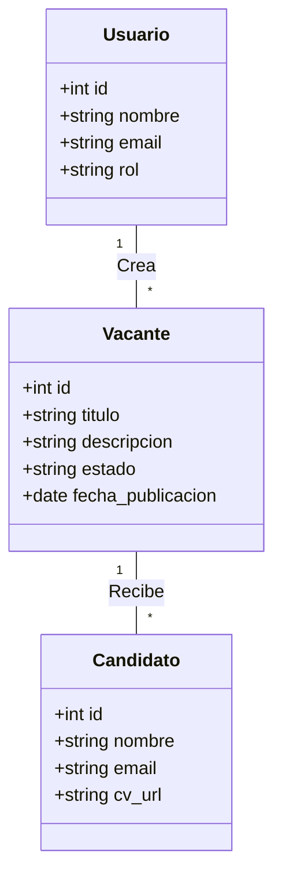
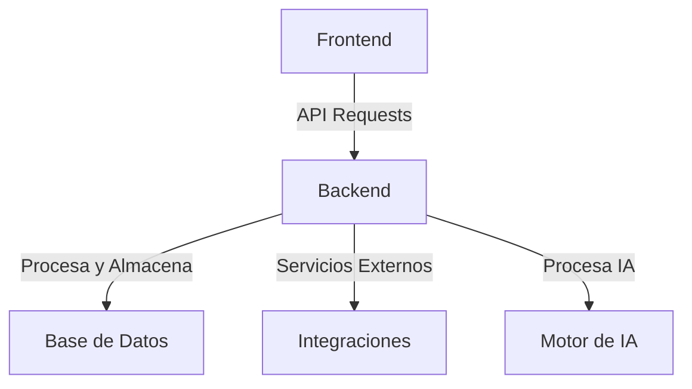
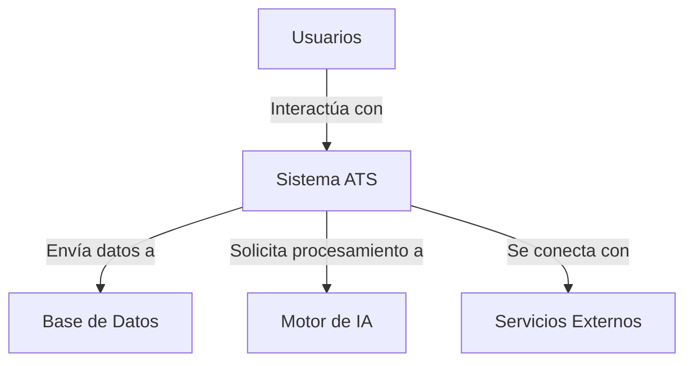
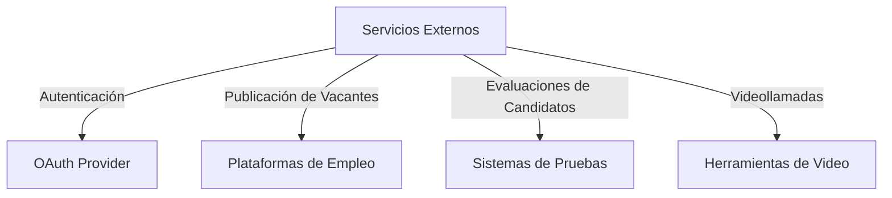

# **LTI: El ATS del Futuro**

## **1. Descripción Breve del Software LTI**

LTI es un sistema de seguimiento de candidatos (ATS) de última generación diseñado para revolucionar la contratación. Nuestro software combina automatización avanzada, colaboración en tiempo real e inteligencia artificial para optimizar el reclutamiento, reducir el tiempo de contratación y mejorar la calidad de las contrataciones.

### **1.1 Valor Añadido y Ventajas Competitivas**

- **Eficiencia para los departamentos de HR**: Reducción de tareas manuales mediante automatización de publicaciones de empleo, cribado de CV y programación de entrevistas.
- **Mejora de la colaboración en tiempo real**: Permite que reclutadores y managers evalúen candidatos simultáneamente, compartan notas y tomen decisiones más rápidas.
- **Automatizaciones inteligentes**: Workflows personalizables que facilitan la gestión de candidatos, envío de recordatorios y actualización de estados.
- **Asistencia de IA**: Screening de candidatos basado en IA, análisis de habilidades y generación automática de descripciones de puestos.
- **Integraciones con herramientas de terceros**: Compatible con plataformas de videollamadas, redes sociales y sistemas de evaluación de habilidades.

### **1.2 Funciones Principales**

1. **Gestión de Vacantes**: Creación y publicación en múltiples portales de empleo con un solo clic.
2. **Seguimiento de Candidatos**: Pipeline visual con estados personalizables para cada etapa del proceso.
3. **Cribado Automático con IA**: Evaluación de CV con algoritmos que identifican coincidencias con la descripción del puesto.
4. **Entrevistas Automatizadas**: Programación inteligente de entrevistas con recordatorios automáticos.
5. **Colaboración en Equipo**: Espacios de comentarios, puntuaciones y feedback en tiempo real.
6. **Analítica y Reportes**: Métricas sobre tiempos de contratación, fuentes de candidatos y calidad de contrataciones.
7. **Automatización de Comunicaciones**: Respuestas automáticas a candidatos, confirmaciones de entrevistas y notificaciones a reclutadores.

### **1.3 Lean Canvas del Modelo de Negocio**

```
| PROBLEMA                   | SOLUCIÓN                           |
|----------------------------|----------------------------------|
| Procesos de selección lentos | ATS con IA y automatización    |
| Falta de colaboración       | Espacios de trabajo compartidos |
| Dificultad para evaluar CVs | Algoritmos de cribado inteligente |

| MÉTRICAS CLAVE             | PROPUESTA DE VALOR              |
|----------------------------|--------------------------------|
| Tiempo de contratación      | Contrataciones más rápidas    |
| Feedback entre equipos      | Decisiones colaborativas      |
| Reducción de tareas manuales | Automatización total         |

| CANALES                    | SEGMENTOS DE CLIENTES          |
|----------------------------|--------------------------------|
| LinkedIn, portales de HR    | Empresas medianas y grandes   |
| Partners estratégicos       | Agencias de reclutamiento     |

| ESTRUCTURA DE COSTOS       | FUENTES DE INGRESOS           |
|----------------------------|--------------------------------|
| Desarrollo de software      | Suscripciones mensuales       |
| Infraestructura en la nube  | Modelos freemium/premium     |
```

---

## **2. Casos de Uso Principales**

### **2.1 Caso de Uso 1: Publicación y Gestión de Vacantes**
#### **Descripción:**
Un reclutador necesita publicar una nueva vacante en múltiples plataformas y hacer un seguimiento de los candidatos aplicantes.

#### **Diagrama de Flujo:**


---

### **2.2 Caso de Uso 2: Cribado Automático de Candidatos**
#### **Descripción:**
El sistema de IA analiza los currículums y selecciona a los mejores candidatos según los criterios establecidos.

#### **Diagrama de Flujo:**


---

### **2.3 Caso de Uso 3: Coordinación de Entrevistas**
#### **Descripción:**
Automatización de la programación de entrevistas entre candidatos y managers.

#### **Diagrama de Flujo:**


---

## **3. Modelo de Datos**



## **4. Diseño del Sistema a Alto Nivel**



## **5. Diagrama C4**



### **5.1 Detalle del Componente de Servicios Externos**



#### **Descripción:**
- **OAuth Provider**: Gestión segura de autenticación de usuarios.
- **Plataformas de Empleo**: Publicación y sincronización con portales como LinkedIn y Indeed.
- **Sistemas de Pruebas**: Evaluación técnica y psicométrica de candidatos.
- **Herramientas de Video**: Integraciones con Zoom y Google Meet para entrevistas.
