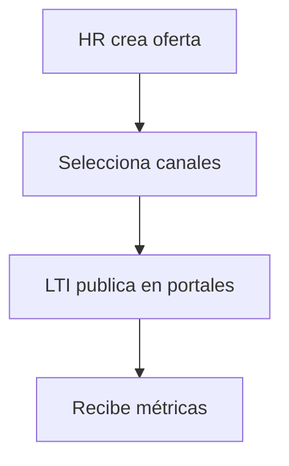
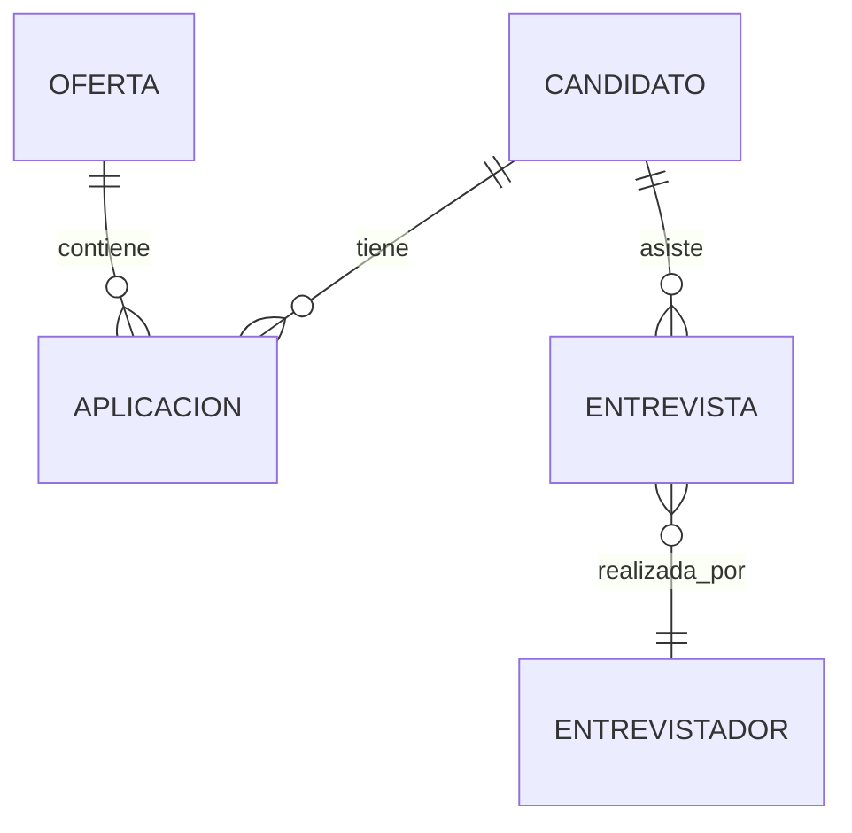
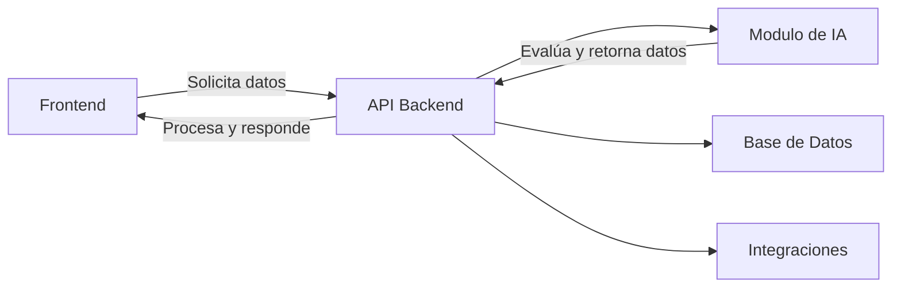
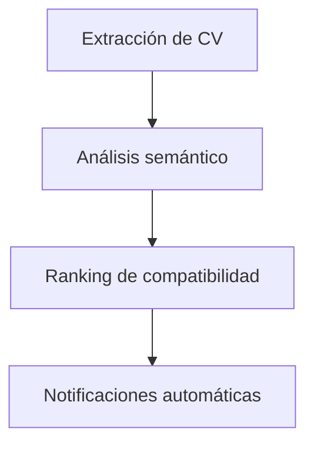

# 📌 LTI - Applicant Tracking System (ATS) del Futuro

## 1️⃣ Descripción de LTI

**LTI** es un sistema **ATS (Applicant Tracking System)** innovador diseñado para revolucionar el proceso de reclutamiento en empresas de todos los tamaños. Su enfoque está en **automatización, colaboración en tiempo real e inteligencia artificial** para mejorar la eficiencia de los equipos de recursos humanos y garantizar contrataciones más rápidas y acertadas.

### 🚀 Valor Añadido y Ventajas Competitivas
- **Automatización Inteligente**: IA para filtrar CVs, programar entrevistas y enviar comunicaciones automáticas.
- **Colaboración en Tiempo Real**: Feedback instantáneo entre reclutadores y managers.
- **Integraciones Multicanal**: Publicación de ofertas en múltiples plataformas con un solo clic.
- **Análisis y Reportes Avanzados**: Datos en tiempo real sobre el pipeline de candidatos.
- **Pruebas y Evaluaciones Integradas**: Tests en línea para evaluar competencias de candidatos.

### 🔑 Funcionalidades Clave
1. **Creación de ofertas de empleo** con plantillas personalizables.
2. **Publicación en múltiples canales** (LinkedIn, Indeed, portales internos, etc.).
3. **Recepción y filtrado de candidaturas** con IA.
4. **Evaluaciones online y programación de entrevistas automática**.
5. **Gestión del pipeline de contratación** con tableros visuales.
6. **Colaboración interna en tiempo real** con comentarios y aprobaciones.
7. **Análisis y métricas de reclutamiento** con reportes personalizados.

### 📊 Lean Canvas
```
| PROBLEMA | SOLUCIÓN | MÉTRICAS CLAVE | PROPUESTA DE VALOR |
|-----------------|-----------------|-----------------|------------------|
| Procesos de reclutamiento largos y manuales | IA y automatización para acelerar el proceso | Tiempo de contratación, tasa de conversión de candidatos, feedback de usuarios | ATS ágil, colaborativo e inteligente |
```

## 2️⃣ Casos de Uso Principales

### **Caso de Uso 1: Publicación de una Oferta de Trabajo**
1. HR crea una oferta con plantilla.
2. Selecciona canales de publicación.
3. LTI publica automáticamente en portales.
4. Recibe métricas sobre visualizaciones y postulaciones.

📍 **Diagrama**:



### **Caso de Uso 2: Evaluación y Entrevista de Candidatos**
1. LTI filtra candidatos por criterios.
2. Envía pruebas online automáticamente.
3. Programación automática de entrevistas.

📍 **Diagrama**:


### **Caso de Uso 3: Contratación y Onboarding**
1. HR selecciona candidato final.
2. Se envía oferta de trabajo digitalmente.
3. Generación de documentos y firma electrónica.

📍 **Diagrama**:


## 3️⃣ Modelo de Datos

| Entidad         | Atributos |
|----------------|----------------|
| **Candidato** | ID, Nombre, Email, CV, Estado |
| **Oferta** | ID, Título, Descripción, Empresa, Fecha Publicación |
| **Aplicación** | ID, CandidatoID, OfertaID, Estado |
| **Entrevista** | ID, CandidatoID, Fecha, Entrevistador |

📍 **Diagrama Relacional**:



## 4️⃣ Diseño del Sistema a Alto Nivel
LTI se estructura en **módulos independientes**, con una arquitectura orientada a microservicios:

- **Frontend**: Aplicación web y móvil para HR y managers.
- **Backend**: API central que gestiona lógica de negocio.
- **Módulo de IA**: Procesamiento de CVs y ranking de candidatos.
- **Integraciones**: Conexión con plataformas de empleo y calendarios.

📍 **Diagrama de Arquitectura**:



## 5️⃣ Diagrama C4: Componente Clave (Procesamiento de Candidatos)

El módulo de procesamiento de candidatos incluye:
1. **Extracción de datos del CV**.
2. **Análisis semántico y ranking de compatibilidad**.
3. **Envío automático de notificaciones y pruebas**.

📍 **Diagrama C4**:



