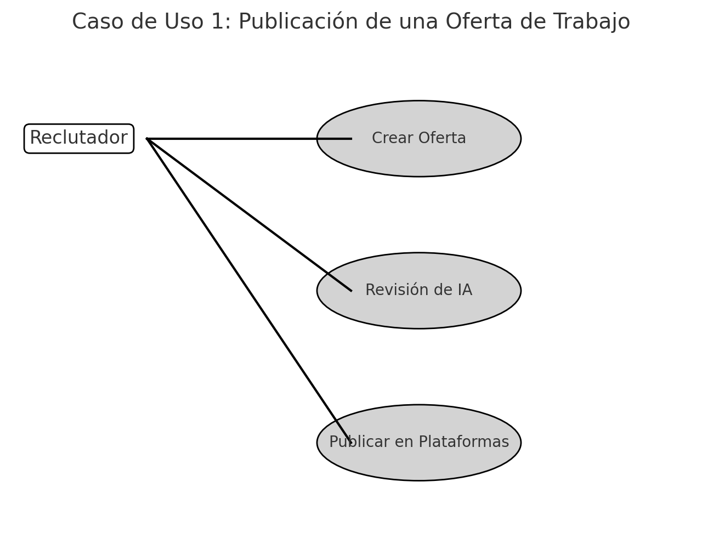
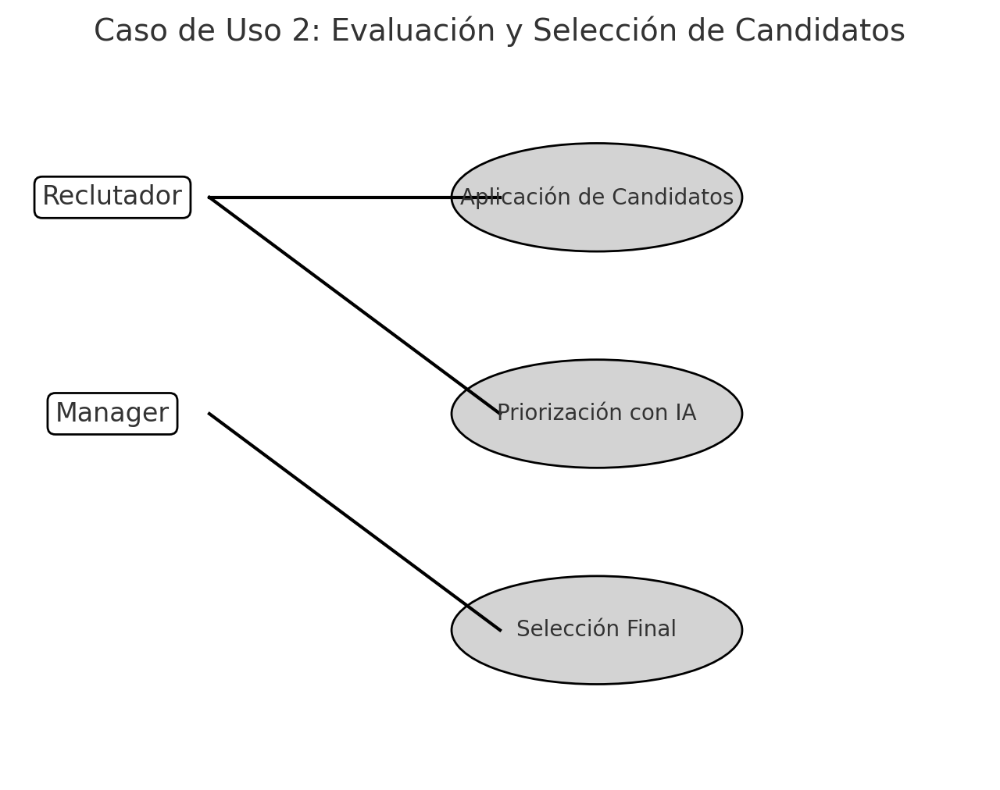
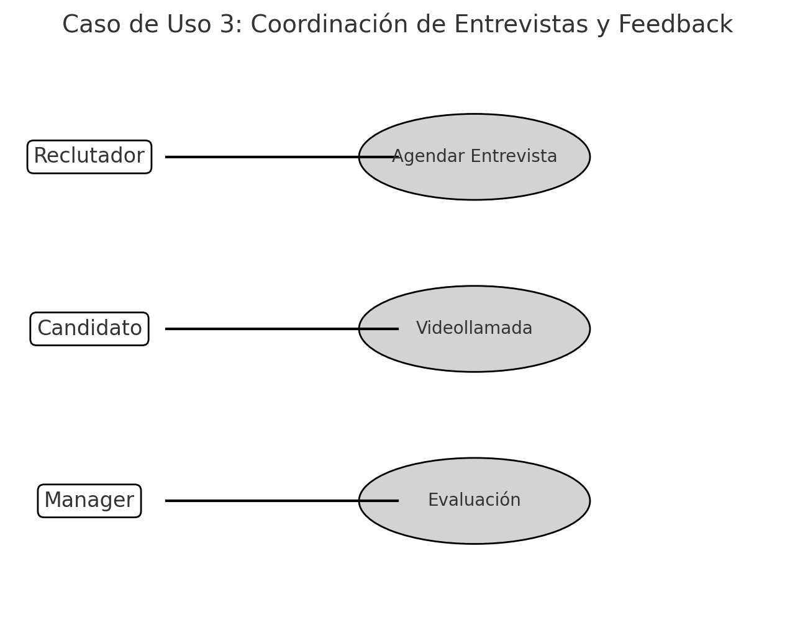

# LTI - Applicant Tracking System del Futuro

## 1. Descripción del Software LTI
LTI es un **sistema avanzado de seguimiento de candidatos (ATS)** diseñado para optimizar y revolucionar los procesos de contratación en empresas modernas. Gracias a su uso de inteligencia artificial, automatización y herramientas de colaboración en tiempo real, LTI se posiciona como la mejor solución para los departamentos de recursos humanos y managers de contratación.

### **Valor añadido y ventajas competitivas**
- **Automatización inteligente**: Reduce el tiempo de gestión con flujos de trabajo optimizados.
- **Colaboración en tiempo real**: Integración con Slack, Teams y plataformas de comunicación internas.
- **Asistencia IA en selección**: Priorización de candidatos con análisis predictivo.
- **Análisis de datos y reporting**: Métricas avanzadas para tomar decisiones basadas en datos.
- **Integraciones fluidas**: Conexión con LinkedIn, portales de empleo y sistemas ERP.

### **Funciones principales**
1. **Gestión de candidatos**: Base de datos centralizada con perfiles detallados.
2. **Automatización de procesos**: Envío de correos, asignación de entrevistas y recordatorios automáticos.
3. **Match de talento con IA**: Priorización y scoring basado en habilidades y experiencia.
4. **Entrevistas y evaluaciones integradas**: Videollamadas y pruebas técnicas dentro de la plataforma.
5. **Gestión de aprobaciones**: Flujo de revisiones entre reclutadores y managers.
6. **Reporting y métricas**: Análisis del embudo de contratación y optimización del proceso.

### **Lean Canvas**
**Problema:**
- Procesos de contratación ineficientes y desorganizados.
- Dificultad para colaborar entre reclutadores y managers.
- Sesgo en la selección de candidatos.
- Falta de datos sobre efectividad de contrataciones.

**Solución:**
- Plataforma todo en uno con automatización y herramientas de IA.
- Colaboración en tiempo real para mejorar la toma de decisiones.
- Análisis de datos para optimizar los procesos de contratación.

**Métricas clave:**
- Reducción del tiempo medio de contratación.
- Aumento de la calidad de los candidatos seleccionados.
- Reducción de costos operativos en contratación.

## 2. Casos de Uso Principales

### **Caso de Uso 1: Publicación de una Oferta de Trabajo**
**Actores:** Reclutador
**Flujo:**
1. El reclutador crea una nueva oferta en LTI.
2. La IA sugiere mejoras en la descripción del puesto.
3. Se publica automáticamente en múltiples plataformas de empleo.
4. Se envían notificaciones a candidatos en la base de datos interna.

### **Caso de Uso 2: Evaluación y Selección de Candidatos**
**Actores:** Reclutador, Manager
**Flujo:**
1. Candidatos aplican a la oferta.
2. La IA prioriza y sugiere los mejores perfiles.
3. El reclutador revisa y selecciona finalistas.
4. El manager recibe notificación para aprobación.

### **Caso de Uso 3: Coordinación de Entrevistas y Feedback**
**Actores:** Reclutador, Candidato, Manager
**Flujo:**
1. Se agenda automáticamente una entrevista con disponibilidad sincronizada.
2. El candidato recibe una invitación con videollamada integrada.
3. Tras la entrevista, el manager califica al candidato dentro de LTI.
4. Se genera un informe con recomendaciones finales.

## 3. Modelo de Datos

### **Entidades Principales**
1. **Candidato** (ID, nombre, email, teléfono, experiencia, skills, currículum)
2. **Oferta de Trabajo** (ID, título, descripción, requisitos, empresa, estado)
3. **Aplicación** (ID, candidato_ID, oferta_ID, estado, fecha_aplicación)
4. **Entrevista** (ID, candidato_ID, reclutador_ID, fecha, resultado)
5. **Empresa** (ID, nombre, sector, empleados)

## 4. Diseño del Sistema a Alto Nivel
LTI se compone de

