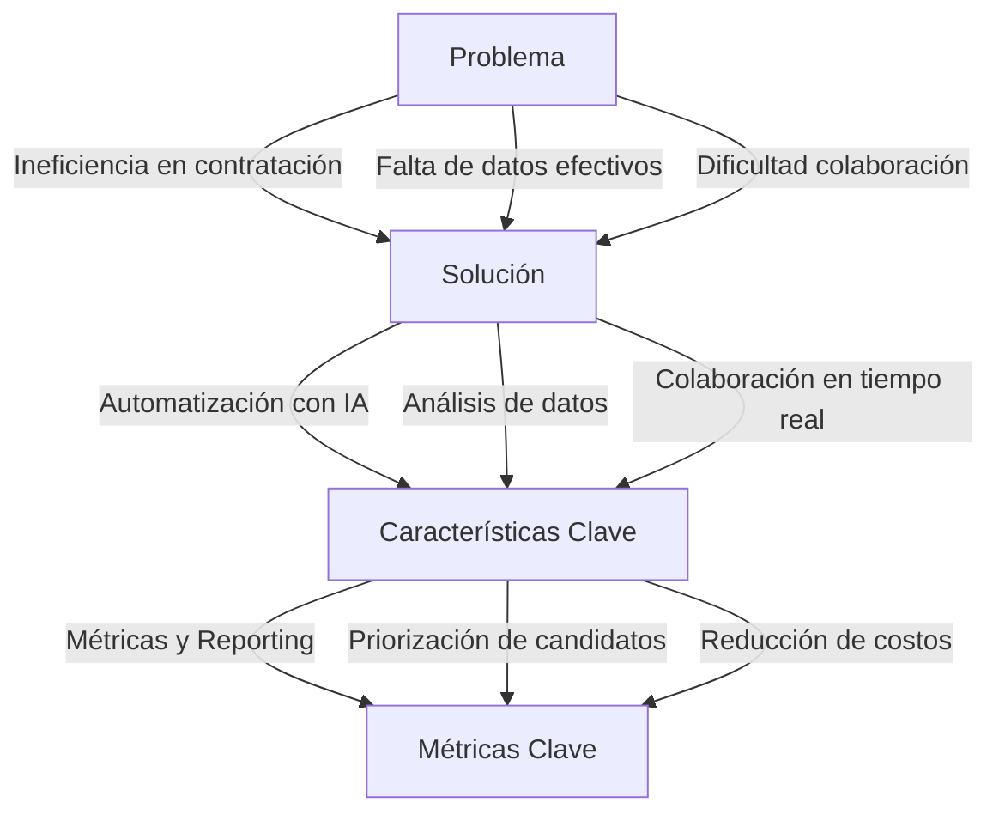
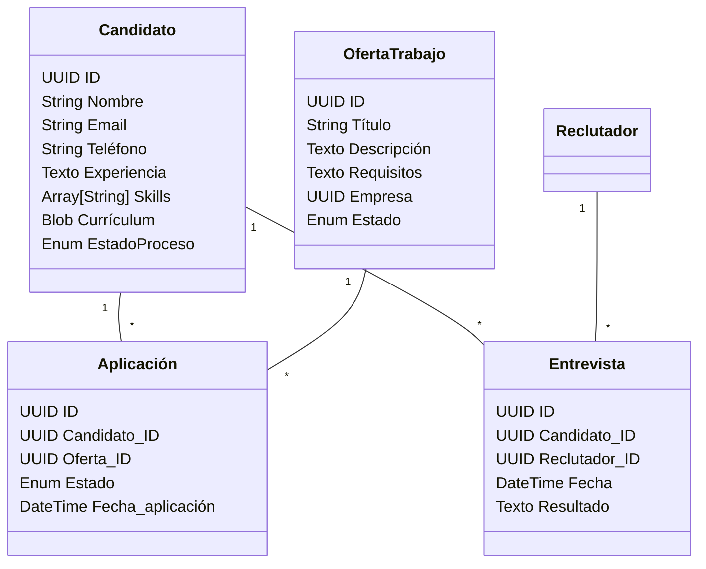
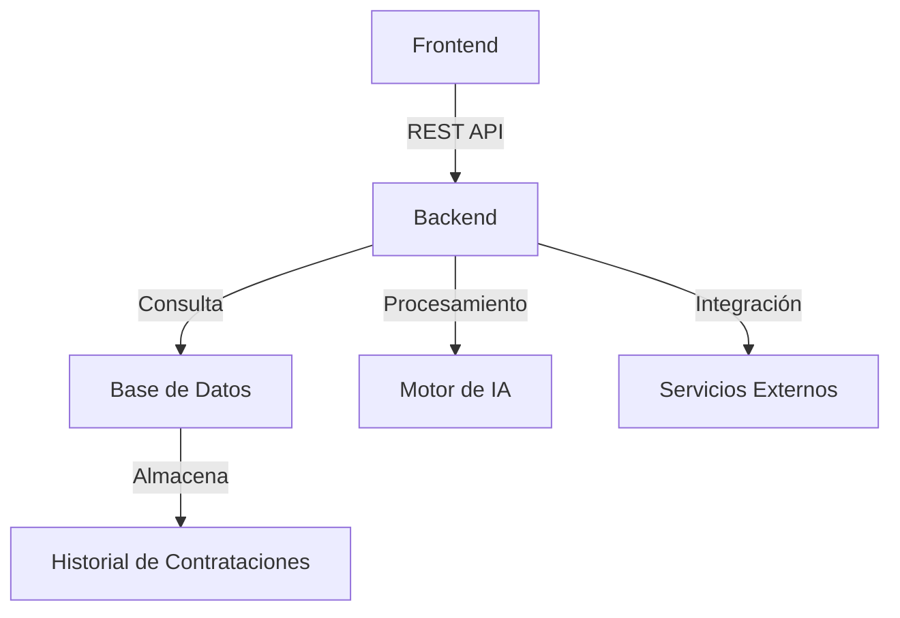
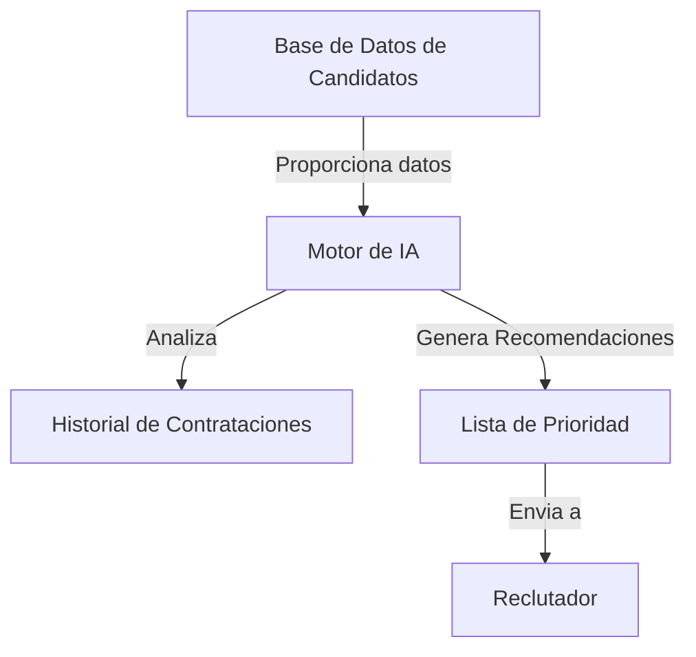

# LTI - Applicant Tracking System del Futuro

## 1. Descripción del Software LTI
LTI es un **sistema avanzado de seguimiento de candidatos (ATS)** diseñado para optimizar y revolucionar los procesos de contratación en empresas modernas. Gracias a su uso de inteligencia artificial, automatización y herramientas de colaboración en tiempo real, LTI se posiciona como la mejor solución para los departamentos de recursos humanos y managers de contratación.

### **Valor añadido y ventajas competitivas**
- **Automatización inteligente**: Reduce el tiempo de gestión con flujos de trabajo optimizados.
- **Colaboración en tiempo real**: Integración con Slack, Teams y plataformas de comunicación internas.
- **Asistencia IA en selección**: Priorización de candidatos con análisis predictivo.
- **Análisis de datos y reporting**: Métricas avanzadas para tomar decisiones basadas en datos.
- **Integraciones fluidas**: Conexión con LinkedIn, portales de empleo y sistemas ERP.

### **Funciones principales**
1. **Gestión de candidatos**: Base de datos centralizada con perfiles detallados.
2. **Automatización de procesos**: Envío de correos, asignación de entrevistas y recordatorios automáticos.
3. **Match de talento con IA**: Priorización y scoring basado en habilidades y experiencia.
4. **Entrevistas y evaluaciones integradas**: Videollamadas y pruebas técnicas dentro de la plataforma.
5. **Gestión de aprobaciones**: Flujo de revisiones entre reclutadores y managers.
6. **Reporting y métricas**: Análisis del embudo de contratación y optimización del proceso.

### **Lean Canvas**



**Problema:**
- Procesos de contratación ineficientes y desorganizados.
- Dificultad para colaborar entre reclutadores y managers.
- Sesgo en la selección de candidatos.
- Falta de datos sobre efectividad de contrataciones.

**Solución:**
- Plataforma todo en uno con automatización y herramientas de IA.
- Colaboración en tiempo real para mejorar la toma de decisiones.
- Análisis de datos para optimizar los procesos de contratación.

**Métricas clave:**
- Reducción del tiempo medio de contratación.
- Aumento de la calidad de los candidatos seleccionados.
- Reducción de costos operativos en contratación.

## 2. Casos de Uso Principales

Los casos de uso representan los principales procesos que facilita LTI:

### Publicación de una oferta de trabajo
Desde la creación hasta la publicación automática y notificación a candidatos.

```mermaid
usecaseDiagram
    actor Reclutador
    participant "Sistema LTI"
    Reclutador -->> "Sistema LTI": Crear oferta
    "Sistema LTI" -->> Reclutador: Confirmación
    "Sistema LTI" -->> "Plataformas de empleo": Publicación automática
    "Plataformas de empleo" -->> Candidatos: Notificación de oferta
```

### Evaluación y selección de candidatos
Filtros avanzados, IA para priorización y gestión de aprobaciones.

```mermaid
usecaseDiagram
    actor Reclutador
    actor Manager
    participant "Sistema LTI"
    Reclutador -->> "Sistema LTI": Filtrar candidatos
    "Sistema LTI" -->> Reclutador: Lista de candidatos priorizados
    Reclutador -->> Manager: Compartir lista final
    Manager -->> "Sistema LTI": Aprobar candidato
```

### Coordinación de entrevistas y feedback
Automatización del agendamiento y evaluación de candidatos.

```mermaid
usecaseDiagram
    actor Reclutador
    actor Candidato
    actor Manager
    participant "Sistema LTI"
    Reclutador -->> "Sistema LTI": Agendar entrevista
    "Sistema LTI" -->> Candidato: Enviar invitación
    Candidato -->> "Sistema LTI": Confirmar disponibilidad
    "Sistema LTI" -->> Reclutador: Notificación de confirmación
    Manager -->> "Sistema LTI": Evaluar entrevista
    "Sistema LTI" -->> Reclutador: Resultado final
```

## 3. Modelo de Datos Mejorado

LTI utiliza un modelo de datos relacional donde las principales entidades están interconectadas para facilitar un flujo de información eficiente.



## 4. Diseño del Sistema a Alto Nivel

El sistema se compone de los siguientes módulos clave:

- **Frontend:** Interfaz de usuario para reclutadores, candidatos y managers.
- **Backend:** Gestión de la lógica de negocio y flujos de contratación.
- **Base de Datos:** Almacenamiento estructurado de candidatos, ofertas y procesos.
- **Motor de IA:** Análisis y recomendaciones basadas en machine learning.
- **Integraciones Externas:** Conexiones con LinkedIn, ERP y plataformas de empleo.



## 5. Diagrama C4 - Módulo de IA para Selección

El motor de IA se encarga de analizar y recomendar los candidatos más adecuados, basándose en datos históricos y criterios definidos por los reclutadores.



---

Este documento es la base inicial para el desarrollo de LTI. Podemos iterar sobre cada módulo y definir más en detalle las funciones críticas a medida que avancemos.

